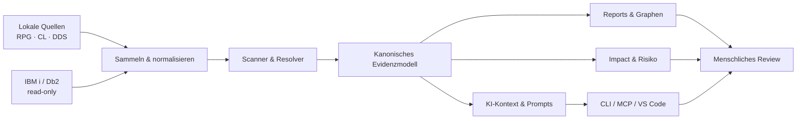
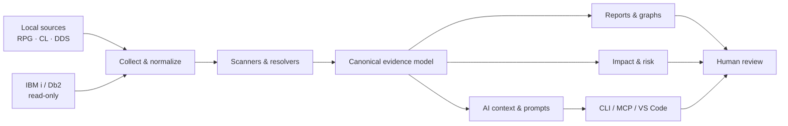

# Zeus RPG PromptKit

<p align="center">
  
</p>

<p align="center">
  
  
  
  
  
  
  
</p>

> **Evidence first. AI second. Humans approve.**  
> Analyse- und Kontext-Toolkit für IBM i RPG, CL und DDS – mit reproduzierbaren Artefakten, kontrollierten KI-Workflows und einem klaren Safety-Modell.

**Schwerpunkte:** `IBM i` · `AS/400` · `RPG` · `CL` · `DDS` · `Db2` · `Static Analysis` · `Impact Analysis` · `AI Context` · `Modernization` · `MCP`

<p align="center">
  <a href="#schnellstart-lokale-demo">Schnellstart</a> ·
  <a href="#wichtige-cli-befehle">CLI</a> ·
  <a href="#lokale-mcp-integration-experimentell">MCP</a> ·
  <a href="#dokumentation">Dokumentation</a> ·
  <a href="#english-version">Englische Fassung</a>
</p>

---

## 🧭 Was ist Zeus RPG PromptKit?

**Zeus RPG PromptKit** sammelt, normalisiert und analysiert RPG-, CL- und DDS-Quellen aus IBM-i-/AS/400-Landschaften. Es ergänzt die Source-Analyse bei Bedarf um Db2-Metadaten und erzeugt daraus nachvollziehbare Artefakte für Entwicklung, Architektur, QA, Modernisierung und KI-gestützte Workflows.

Zeus ist bewusst **kein autonomer Business-Code-Generator**. Das Projekt bildet eine **Evidence Preparation Layer** zwischen gewachsener IBM-i-Logik und den Menschen oder KI-Assistenten, die diese Logik verstehen, prüfen und verändern sollen.

Damit beantwortet Zeus Fragen wie:

- Welche Programme, Prozeduren, Dateien, Felder und Tabellen hängen zusammen?
- Welche Auswirkungen kann eine geplante Änderung haben?
- Welche Referenzen sind sicher aufgelöst – und welche bleiben unklar?
- Welche Db2-Metadaten werden für eine belastbare Einordnung benötigt?
- Welcher Kontext kann kontrolliert an einen KI-Assistenten übergeben werden?
- Wie bleiben Agenten-Workflows lokal, begrenzt, auditierbar und reviewfähig?

> [!IMPORTANT]
> **Unterstützter Produktpfad:** CLI und MCP erzeugen die Evidenz und Artefakte. `zeus serve` ist ein optionaler, lokaler und experimenteller Viewer für bereits vorhandene Ergebnisse.

> [!NOTE]
> Das Projekt befindet sich in aktiver Entwicklung. CLI-Verträge, Workflows, Artefakte, MCP-Tools und experimentelle Integrationen können sich zwischen Releases ändern. Die verbindliche Referenz ist [`docs/tool-catalog.md`](docs/tool-catalog.md).

## ✨ Kernfunktionen

| Bereich | Was Zeus leistet |
|---|---|
| Source-Beschaffung | Source-Member und IFS-Inhalte per SFTP, JT400 oder FTP lesen und lokal ablegen |
| Statische Analyse | RPG, CL und DDS scannen, Entitäten erkennen und Referenzen extrahieren |
| Abhängigkeiten | Programmaufrufe, Datei-/Tabellennutzung, Felder und Reverse-Impact-Beziehungen sichtbar machen |
| Db2-Kontext | Tabellen, Spalten, Keys, Trigger, Views, Aliase und weitere Metadaten read-only ergänzen |
| Evidence-Artefakte | Markdown-Reports, JSON-Modelle, Mermaid-Graphen, Manifeste und KI-Prompts erzeugen |
| Investigation | Vorhandene Analyseergebnisse fokussiert durchsuchen und schrittweise vertiefen |
| Review & Planung | Risikoanalysen, Testszenarien, QA-Ausgaben, Checklisten und Bundles vorbereiten |
| KI-Integration | Lokale MCP-Tools, kuratierte Ressourcen und Prompt-Verträge kontrolliert bereitstellen |
| Erweiterbarkeit | Eigene Analyzer, Analyse-Stages, Plugins und MCP-Tools über die Programmatic API registrieren |
| Editor-Integration | Experimentelle VS-Code-Extension mit lokaler Analyse und optionaler Code-for-IBM-i-Anbindung |

Zeus ist KI-anbieterneutral. Die erzeugten Artefakte können in klassischen Reviews oder mit ChatGPT, GitHub Copilot, Claude, lokalen Modellen und anderen Werkzeugen verwendet werden.

## 🧱 Wie Zeus arbeitet



Der typische Ablauf bleibt bewusst nachvollziehbar:

1. Umgebung und Profil prüfen.
2. Quellen lokal bereitstellen oder read-only von IBM i holen.
3. Analyse und optionale Metadatenanreicherung ausführen.
4. Reports, Graphen und JSON-Artefakte prüfen.
5. Erst danach KI, Investigation, Impact-Analyse oder Änderungsplanung einsetzen.

## 🛡️ Safety-Modell

| Level | Bedeutung | Typische Aktion |
|---|---|---|
| `S0` | Lokal read-only | Dateien lesen, Konfiguration prüfen, Artefakte anzeigen |
| `S1` | Lokaler Schreibzugriff | Reports, Bundles, Prompts oder Analyseartefakte erzeugen |
| `S2` | Remote read-only | IBM i oder Db2 lesen, ohne Daten oder Objekte zu verändern |
| `S3` | Kontrolliertes Schreiben | DML ausschließlich mit expliziter Freigabe und Guardrails |
| `S4` | Operator-gated High Risk | Bridge-, Apply- oder Compile-artige Aktionen; niemals implizit |

Wichtige Leitplanken:

- Read-only ist der Standard für lokale und entfernte Analyse-Workflows.
- Riskante Aktionen müssen sichtbar, begründet und ausdrücklich freigegeben werden.
- Änderungen werden möglichst zuerst lokal als Plan, Diff oder Artefakt vorbereitet.
- Produktionsprofile bleiben bei nicht freigegebenen Write-Pfaden blockiert.
- Lokale Ausgaben und Audit-Dateien können sensible Fachlogik enthalten.
- Für externe Reviews sollte `--safe-sharing` verwendet werden.

## ⚡ Schnellstart: lokale Demo

### Voraussetzungen

- Node.js 20 oder neuer
- Java 11 oder neuer für JT400-/Db2-nahe Funktionen
- optional: IBM-i-Zugang für Fetch-, Discovery- oder Db2-Workflows

### Installation und Demo

```bash
git clone https://github.com/gzeuner/zeus-rpg-promptkit.git
cd zeus-rpg-promptkit
npm install
npm run demo:run
```

Typische Demo-Ausgaben:

```text
examples/demo-rpg-mini-system/output-baseline/report.md
examples/demo-rpg-mini-system/output-baseline/architecture-report.md
examples/demo-rpg-mini-system/output-baseline/ai-knowledge.json
examples/demo-rpg-mini-system/output-baseline/dependency-graph.mmd
```

Optionaler lokaler Viewer:

```bash
node cli/zeus.js serve \
  --source-output-root ./examples/demo-rpg-mini-system/output-baseline
```

Danach im Browser öffnen:

```text
http://127.0.0.1:4782
```

KI-Session-Prompt aus den Demo-Artefakten erzeugen:

```bash
npm run demo:prompt
```

Mehr Details: [`docs/quickstart/5-minutes.md`](docs/quickstart/5-minutes.md)

## 🔎 Eigene lokale Quellen analysieren

```bash
node cli/zeus.js analyze \
  --source ./rpg_sources \
  --program ORDERPGM \
  --out ./output \
  --optimize-context \
  --dense full
```

Nützliche Optionen für größere Programme und reproduzierbare Läufe:

| Option | Zweck |
|---|---|
| `--dense lite\|full\|ultra` | rangbasierte Reduktion und Kompaktierung von Reports und Prompts |
| `--prompt-max-tokens <n>` | maximales Token-Budget für Prompt-Artefakte |
| `--skip-db2-metadata` | Analyse ohne Db2-Metadaten ausführen |
| `--with-known-facts` | lokale, profilbezogene Known Facts explizit einblenden |
| `--safe-sharing` | sensible Inhalte für externe Weitergabe reduzieren |
| `--reproducible` | stabile, reproduzierbare Ausgabe für CI und Vergleiche |
| `--json` | maschinenlesbare Kommandoausgabe erzeugen |

Typische Ergebnisstruktur:

```text
output/ORDERPGM/
├── report.md
├── architecture-report.md
├── canonical-analysis.json
├── ai-knowledge.json
├── ai_prompt_documentation.md
├── dependency-graph.mmd
└── analyze-run-manifest.json
```

> [!TIP]
> Lies zuerst `report.md` und `architecture-report.md`. Nutze anschließend `canonical-analysis.json`, Impact-Analysen und Db2-Metadaten für die Vertiefung.

## 🔌 Mit einem IBM-i-System arbeiten

### 1. Lokales Profil anlegen

```bash
cp config/profiles.example.json config/local-only/profiles.json
```

Windows PowerShell:

```powershell
Copy-Item config/profiles.example.json config/local-only/profiles.json
```

Empfohlene Startprofile:

- `dev` – tägliche Entwicklung
- `demo` – lokale Smoke-Checks ohne IBM i
- `sftp-fetch` – reiner Fetch-Workflow
- `readonly-db2` – geschützte read-only Db2-Zugriffe
- `combined-fetch-and-query` – End-to-End-Beispiel

### 2. Umgebung laden und prüfen

Linux/macOS:

```bash
source ./config/load-env.sh project
node cli/zeus.js doctor --profile dev --probe --show-resolved
```

Windows PowerShell:

```powershell
. .\config\load-env.ps1 -Environment project
node .\cli\zeus.js doctor --profile dev --probe --show-resolved
```

### 3. Umgebung entdecken, Quellen holen und analysieren

```bash
# Read-only Discovery
node cli/zeus.js discover-environment \
  --profile dev \
  --include-members \
  --json

# Objektauflösung prüfen
node cli/zeus.js resolve-object \
  --profile readonly-db2 \
  --table APP_TABLE_00 \
  --require-column CASE_ID

# Quellen holen
node cli/zeus.js fetch \
  --profile combined-fetch-and-query \
  --system dev \
  --members ORDERPGM

# Analyse starten
node cli/zeus.js analyze \
  --profile dev \
  --source ./rpg_sources \
  --program ORDERPGM \
  --out ./output \
  --optimize-context \
  --dense full
```

Profile können mehrere benannte `systems` mit `displayName`, `systemName` und `aliases` enthalten. `doctor --probe --show-resolved` zeigt die aufgelöste Zuordnung; `fetch --system <name>` wählt ein System zur Laufzeit aus, ohne das Profil zu verändern.

Vollständiges Onboarding: [`docs/quickstart/onboarding-new-ibm-i.md`](docs/quickstart/onboarding-new-ibm-i.md)

## 🔐 Credentials und Secret Vault

**Klartext-Passwörter gehören weder in Commits noch in gemeinsam genutzte Profile.** Zeus unterstützt verschlüsselte Werte im Format `enc:v1:...` und entschlüsselt sie während der Runtime-Konfigurationsauflösung.

### Schlüssel anlegen

```bash
node cli/zeus.js secret init-key
```

Unter Windows kann ein DPAPI-geschützter Schlüssel verwendet werden:

```powershell
node .\cli\zeus.js secret init-key --windows
```

### Wert verschlüsseln

```bash
node cli/zeus.js secret encrypt --value "MeinGeheimesPasswort"
```

Sicherer über `stdin`, damit das Passwort nicht in der Shell-History landet:

```bash
printf '%s' 'MeinGeheimesPasswort' | node cli/zeus.js secret encrypt
```

Verschlüsselten Wert verwenden:

```dotenv
ZEUS_DB_PASSWORD=enc:v1:BASE64...
ZEUS_FETCH_PASSWORD=enc:v1:BASE64...
```

Profilreferenz:

```json
{
  "db": {
    "password": "${env:ZEUS_DB_PASSWORD}"
  }
}
```

Status und Hygiene prüfen:

```bash
node cli/zeus.js secret status
node cli/zeus.js secret check
node cli/zeus.js doctor --profile dev --strict
```

Priorität der Schlüsselquellen:

1. `ZEUS_SECRET_KEY`
2. Windows DPAPI
3. `config/local-only/.zeus-key`

Details: [`docs/quickstart/secrets-and-overrides.md`](docs/quickstart/secrets-and-overrides.md)

## 🧰 Wichtige CLI-Befehle

Der automatisch erzeugte [`docs/tool-catalog.md`](docs/tool-catalog.md) ist die **verbindliche Referenz** für Befehle, Optionen, Safety-Level und Beispiele.

| Aufgabe | Befehle | Safety |
|---|---|---:|
| Setup & Profile | `doctor`, `profiles`, `resources`, `secret` | `S0` |
| Discovery | `discover-environment`, `resolve-object`, `inspect-object`, `joblog` | `S0/S2` |
| Quellen | `fetch`, `fetch-member`, `copy-to-workspace`, `diff` | `S1/S2` |
| Analyse | `analyze`, `investigate`, `workflow`, `workflow run` | `S0/S1` |
| Suche & Beziehungen | `search-source`, `field-search`, `trace`, `xref`, `impact` | `S0–S2` |
| Db2 read-only | `query-table`, `query-sql`, `sql` | `S2` |
| Review & Planung | `assess-risk`, `generate-test`, `generate-checklist`, `qa` | `S1` |
| Artefakte | `bundle`, `analyses`, `serve` | `S0/S1` |
| Kontrollierte Writes | `write-sql`, `upsert`, `insert`, `update`, `delete` | `S3` |
| Operator-gated | `bridge` | `S4` |
| Integrationen | `mcp`, `docs:generate-catalog`, `pui-inspect`, `pui-edit` | abhängig vom Kommando |

Beispiele:

```bash
node cli/zeus.js doctor --profile dev --show-resolved
node cli/zeus.js search-source --source-root ./rpg_sources --search-term "CHAIN("
node cli/zeus.js investigate --program ORDERPGM --profile dev --goal "Fehlerpfade prüfen"
node cli/zeus.js impact --field RECORD_ID --program ORDERPGM --source ./rpg_sources --out ./output
node cli/zeus.js assess-risk --program ORDERPGM --out ./output
node cli/zeus.js bundle --program ORDERPGM --source-output-root ./output --include-md --include-json
node cli/zeus.js docs:generate-catalog
```

### Workflow-Presets

```bash
node cli/zeus.js workflow --preset onboarding --source ./rpg_sources --program ORDERPGM
node cli/zeus.js workflow --preset architecture-review --source ./rpg_sources --program ORDERPGM
node cli/zeus.js workflow --preset security-review --source ./rpg_sources --program ORDERPGM
node cli/zeus.js workflow --preset modernization-review --source ./rpg_sources --program ORDERPGM
node cli/zeus.js workflow --preset dependency-risk --source ./rpg_sources --program ORDERPGM
node cli/zeus.js workflow --preset refactoring-review --source ./rpg_sources --program ORDERPGM
node cli/zeus.js workflow --preset test-generation-review --source ./rpg_sources --program ORDERPGM
```

## 🤖 Lokale MCP-Integration (experimentell)

Zeus kann eine kontrollierte Tool-Oberfläche über **MCP und lokalen `stdio`-Transport** bereitstellen. Ziel ist nicht „der Agent darf alles“, sondern eine begrenzte, auditierbare und standardmäßig read-orientierte Integration.

```bash
node cli/zeus.js mcp serve --stdio true --verbose
```

Für reale Workflows sollte die Oberfläche mit `--allow-tools` auf die tatsächlich benötigten Tools begrenzt werden.

Sicherheitsrahmen:

| Bereich | Verhalten |
|---|---|
| Transport | lokal über `stdio` |
| Policy | sichere Default-Oberfläche plus explizite Allowlist |
| Ressourcen | kuratierte Dokumentation, Metadaten und Run-Artefakte |
| Redaction | Maskierung typischer Secrets in Responses und Fehlern |
| Audit | append-only JSONL unter `.local/mcp/audit/mcp-audit.jsonl` |
| Guardrails | Timeouts, Antwortgrößenlimits und deterministische Fehler |
| Pfade | lokale Pfade müssen innerhalb des Workspace bleiben |
| Writes | standardmäßig blockiert; Apply benötigt mehrere explizite Freigaben |

`zeus.write-sql` unterscheidet zwischen nicht mutierendem `plan` und streng geschütztem `apply`. Apply benötigt unter anderem aktivierte Write-Pfade, ein Bestätigungstoken und passende Profilregeln; Produktionsprofile bleiben blockiert.

Operator-Guide: [`docs/mcp/operator-guide.md`](docs/mcp/operator-guide.md)

## 🧩 Erweiterbare API

Das Paket exportiert neben der CLI eine Programmatic API unter `./api`:

```js
const { zeus } = require('zeus-rpg-promptkit/api');

zeus.analyzers.registerAnalyzer('my-analyzer', {
  run(context) {
    return { customEvidence: true };
  }
});

zeus.mcpTools.registerTool('my.tool', {
  description: 'Custom local tool',
  inputSchema: { type: 'object' },
  execute: async (args) => ({ ok: true, args })
});

zeus.registerPlugin(myPlugin);
```

Zentrale Erweiterungspunkte:

- Analyzer Registry
- Analyze Stage Registry
- MCP Tool Registry
- Plugin-Registrierung
- Workflow-, Fetch-, Query- und Run-Explorer-Services
- persistente lokale Investigation Sessions

Die Knowledge API bleibt absichtlich deaktiviert, bis ein finaler, projektneutraler Katalog alle Privacy-Gates bestanden hat.

## 🧠 Projektneutrale Knowledge-Pipeline

Unter `src/knowledge/` existieren bewusst getrennte Vertragsgrenzen:

- `raw/` – sensible Roh-Evidenz
- `sanitized/` – redaktierte Kandidaten
- `final/` – projektneutrale Katalogverträge
- `privacy/` – fail-closed Privacy-Gates

Source-abgeleitete Projektdaten werden nicht automatisch zu wiederverwendbarem Toolkit-Wissen. Lokale Known Facts liegen unter `config/local-only/known-facts/<profile>.json`, werden nur mit `--with-known-facts` geladen und bleiben getrennt von der projektneutralen Pipeline.

## 🧑‍💻 VS-Code-Integration (in Entwicklung)

Unter `vscode-extension/` liegt eine experimentelle Extension-Grundlage. Sie:

- analysiert das aktuell geöffnete Programm oder Member,
- zeigt lokale Analysen und Reports im Editor,
- verwendet dieselbe erweiterbare Zeus API wie CLI und MCP,
- kann neben **Code for IBM i** arbeiten,
- bleibt mit lokalem Fallback auch ohne aktive IBM-i-Verbindung nutzbar.

Die Extension ist derzeit ein Entwicklungsartefakt und noch nicht der primäre Produktpfad.

## 📦 Analyseartefakte

| Datei | Inhalt |
|---|---|
| `report.md` | kompakte Programmzusammenfassung |
| `architecture-report.md` | Struktur, Call-Beziehungen und Abhängigkeiten |
| `canonical-analysis.json` | vollständiges Entitäts- und Evidenzmodell |
| `ai-knowledge.json` | token-optimierter Kontext für diesen Analyse-Run |
| `ai_prompt_*.md` | aufgabenspezifische, einsatzbereite KI-Prompts |
| `dependency-graph.mmd` | Mermaid-Abhängigkeitsgraph |
| `analyze-run-manifest.json` | Run-Metadaten und Artefaktinventar |

`ai-knowledge.json` ist **keine persistente, projektneutrale Knowledgebase**, sondern eine Projektion eines konkreten Analyse-Laufs.

## 📚 Dokumentation

| Einstieg | Zweck |
|---|---|
| [`docs/index.md`](docs/index.md) | zentraler Dokumentations-Hub |
| [`docs/tool-catalog.md`](docs/tool-catalog.md) | verbindliche Command-, Safety- und Scope-Referenz |
| [`docs/ai/session-prompt.md`](docs/ai/session-prompt.md) | Bootstrap für Evidence-first-KI-Sessions |
| [`docs/quickstart/5-minutes.md`](docs/quickstart/5-minutes.md) | schnellster lokaler Einstieg |
| [`docs/quickstart/onboarding-new-ibm-i.md`](docs/quickstart/onboarding-new-ibm-i.md) | vollständiges IBM-i-Onboarding |
| [`docs/mcp/operator-guide.md`](docs/mcp/operator-guide.md) | MCP-Betrieb, Policy und Troubleshooting |
| [`docs/safety/`](docs/safety/) | Governance, sichere Weitergabe und Workspace-Regeln |
| [`docs/workflows/`](docs/workflows/) | geführte Analyse- und Agenten-Workflows |
| [`docs/sql/`](docs/sql/) | reproduzierbare Discovery-Abfragen für Db2 for i |

Tool-Katalog nach Änderungen an der CLI neu erzeugen:

```bash
node cli/zeus.js docs:generate-catalog
```

Optional zusätzlich als JSON:

```bash
node cli/zeus.js docs:generate-catalog --json-output docs/tool-catalog.json
```

## 🏗️ Architekturüberblick

| Bereich | Verantwortung |
|---|---|
| `cli/` | ausführbare CLI und Catalog-Generator |
| `src/collector/`, `src/fetch/`, `src/source/` | Source Discovery und Beschaffung |
| `src/scanner/`, `src/dependency/` | Scanner, Beziehungen und Cross-References |
| `src/context/`, `src/analyze/`, `src/investigation/` | kanonisches Modell, Pipeline und Vertiefung |
| `src/db2/`, `src/java/` | Db2-/JT400-nahe Runtime-Funktionen |
| `src/report/`, `src/prompt/`, `src/bundle/` | Reports, Prompts und Review-Bundles |
| `src/security/`, `src/sharing/`, `src/reproducibility/` | Secrets, Redaction, Safe Sharing und stabile Outputs |
| `src/mcp/` | lokaler MCP-Server, Policy, Ressourcen, Prompts und Audit |
| `src/api/` | Programmatic API und Registries |
| `src/viewer/`, `src/ui/`, `src/pui/` | optionale lokale Ansichten und experimentelle UI-Funktionen |
| `vscode-extension/` | experimentelle Editor-Integration |
| `tests/` | Unit-, Contract-, Smoke-, Corpus- und Benchmark-Tests |

## ✅ Tests

```bash
npm test
npm run test:unit
npm run test:smoke
npm run test:contract
npm run test:corpus
npm run test:benchmark
```

Demo-spezifische Checks:

```bash
npm run demo:run
npm run demo:prompt
npm run demo:safety-check
```

## ✅ Bewährte Vorgehensweisen

- Erst Evidenz erzeugen, dann KI einsetzen.
- `docs/tool-catalog.md` als Single Source of Truth behandeln.
- Profile, Schlüssel und Credentials außerhalb des Repositories halten.
- Encoding früh normalisieren, vorzugsweise nach UTF-8.
- Db2-Metadaten einbeziehen, wenn Constraints, Trigger oder dynamisches SQL relevant sind.
- Unaufgelöste Referenzen sichtbar lassen und nicht „weginterpretieren“.
- KI-Antworten gegen Reports, `canonical-analysis.json` und Db2-Metadaten prüfen.
- MCP-Tools so eng wie möglich allowlisten.
- `.local/`, `output/`, `.zeus/` und Audit-Dateien als potenziell sensibel behandeln.
- Für externe Weitergabe `--safe-sharing` verwenden.

## 🚫 Was Zeus nicht ersetzt

Zeus ersetzt weder Fachwissen noch Code-Review, Tests, Freigaben oder einen verantwortlichen Betriebsprozess. Insbesondere:

- schreibt Zeus nicht autonom Business-Code auf IBM i,
- führt Zeus keine ungeprüften Produktionsänderungen aus,
- garantiert Zeus keine vollständige Analyse bei unvollständigen Quellen,
- werden KI-Ausgaben nicht automatisch zu verlässlichen Entscheidungen,
- ist Zeus kein offizielles IBM-Produkt und nicht mit IBM verbunden.

<details>
<summary><strong>Verantwortung, Gewährleistung und Haftung</strong></summary>

Zeus RPG PromptKit ist ein freies Open-Source-Projekt. Software, Dokumentation, Beispiele, Prompts und erzeugte Artefakte werden ohne Gewährleistung bereitgestellt. Sie können Fehler enthalten, unvollständig sein oder für eine konkrete Umgebung ungeeignet sein. Die Nutzung erfolgt auf eigene Verantwortung.

Wer Zeus einsetzt, bleibt insbesondere verantwortlich für Konfiguration, Profile, Zugangsdaten, Auswahl und Ausführung von Befehlen, SQL-Abfragen, den Umgang mit produktiven Systemen und sensiblen Daten sowie für Review, Tests, Freigabe, Deployment und Betrieb eigener Änderungen.

KI-gestützte Werkzeuge können falsche, unvollständige oder riskante Vorschläge erzeugen. Weder Zeus noch ein KI-Assistent treffen verbindliche Entscheidungen. Änderungen an Code, Daten, Konfiguration oder Systemen müssen von den verantwortlichen Menschen geprüft, getestet und freigegeben werden.

Soweit gesetzlich zulässig, übernehmen Autorinnen, Autoren, Maintainer und Beitragende keine Haftung für Schäden, Datenverluste, Betriebsunterbrechungen, Sicherheitsvorfälle, fehlerhafte Analysen oder falsche KI-Ausgaben. Gesetzlich zwingende Haftung bleibt unberührt.

Dieser Hinweis ergänzt die Apache License 2.0, ersetzt sie aber nicht. Maßgeblich bleibt die Datei [`LICENSE`](LICENSE).

</details>

<details>
<summary><strong>Marken- und Herstellerhinweis</strong></summary>

IBM, IBM i, AS/400, Db2, RPG, CL, DDS, JTOpen, JT400 und weitere genannte Produktnamen können Marken oder eingetragene Marken ihrer jeweiligen Eigentümer sein.

Zeus RPG PromptKit ist ein unabhängiges Open-Source-Projekt und wird von IBM oder anderen Herstellern weder unterstützt noch gesponsert, empfohlen oder zertifiziert.

</details>

## 📄 Lizenz

Zeus RPG PromptKit steht unter der [Apache License 2.0](LICENSE).

JTOpen / IBM Toolbox for Java kann für IBM-i-/Db2-nahe Funktionen erforderlich sein, ist jedoch nicht Bestandteil dieses Projekts und wird nicht mit Zeus ausgeliefert. Weitere Informationen: [IBM/JTOpen](https://github.com/IBM/JTOpen)

<p align="right"><a href="#zeus-rpg-promptkit">Nach oben ↑</a></p>

<a id="english-version"></a>

---

## 🧭 What is Zeus RPG PromptKit?

**Zeus RPG PromptKit** collects, normalizes, and analyzes RPG, CL, and DDS sources from IBM i / AS/400 environments. It can enrich source analysis with Db2 metadata and turn the result into reviewable artifacts for developers, architects, QA teams, modernization projects, and AI-assisted workflows.

Zeus is deliberately **not an autonomous business-code generator**. It acts as an **Evidence Preparation Layer** between long-lived IBM i logic and the humans or AI assistants that need to understand, review, and change that logic.

Zeus helps answer questions such as:

- Which programs, procedures, files, fields, and tables depend on each other?
- What could be affected by a planned change?
- Which references are resolved with evidence, and which remain uncertain?
- Which Db2 metadata is required for a reliable conclusion?
- Which context can safely be passed to an AI assistant?
- How can agent workflows remain local, bounded, auditable, and reviewable?

> [!IMPORTANT]
> **Supported product path:** CLI and MCP produce evidence and artifacts. `zeus serve` is an optional, local-only, experimental viewer for existing output.

> [!NOTE]
> The project is under active development. CLI contracts, workflows, artifacts, MCP tools, and experimental integrations may change between releases. The authoritative reference is [`docs/tool-catalog.md`](docs/tool-catalog.md).

## ✨ Core capabilities

| Area | What Zeus provides |
|---|---|
| Source acquisition | Read source members and IFS content through SFTP, JT400, or FTP and store them locally |
| Static analysis | Scan RPG, CL, and DDS, identify entities, and extract references |
| Dependencies | Reveal program calls, file/table usage, fields, and reverse-impact relationships |
| Db2 context | Add read-only metadata for tables, columns, keys, triggers, views, aliases, and more |
| Evidence artifacts | Generate Markdown reports, JSON models, Mermaid graphs, manifests, and AI prompts |
| Investigation | Search and deepen existing analysis results in focused, iterative sessions |
| Review and planning | Prepare risk assessments, test scenarios, QA output, checklists, and review bundles |
| AI integration | Expose local MCP tools, curated resources, and prompt contracts under explicit policy |
| Extensibility | Register custom analyzers, analysis stages, plugins, and MCP tools through the API |
| Editor integration | Use an experimental VS Code extension with local analysis and optional Code for IBM i support |

Zeus is AI-provider agnostic. Its artifacts can be used in traditional reviews or with ChatGPT, GitHub Copilot, Claude, local models, and other tools.

## 🧱 How Zeus works



The normal operating sequence is intentionally transparent:

1. Validate the environment and profile.
2. Provide sources locally or fetch them read-only from IBM i.
3. Run analysis and optional metadata enrichment.
4. Review reports, graphs, and JSON artifacts.
5. Only then use AI, investigation, impact analysis, or change planning.

## 🛡️ Safety model

| Level | Meaning | Typical action |
|---|---|---|
| `S0` | Local read-only | read files, validate configuration, inspect artifacts |
| `S1` | Local write | create reports, bundles, prompts, or analysis artifacts |
| `S2` | Remote read-only | read IBM i or Db2 without changing data or objects |
| `S3` | Controlled write | run DML only with explicit approval and guardrails |
| `S4` | Operator-gated high risk | bridge/apply/compile-style operations; never implicit |

Key guardrails:

- Read-only is the default for local and remote analysis workflows.
- Risky actions must be visible, explained, and explicitly approved.
- Changes should be prepared locally as plans, diffs, or artifacts first.
- Production profiles remain blocked for unapproved write paths.
- Local output and audit files may contain sensitive business logic.
- Use `--safe-sharing` for external review.

## ⚡ Quickstart: local demo

### Requirements

- Node.js 20 or newer
- Java 11 or newer for JT400/Db2-related features
- optional: IBM i access for fetch, discovery, or Db2 workflows

### Install and run

```bash
git clone https://github.com/gzeuner/zeus-rpg-promptkit.git
cd zeus-rpg-promptkit
npm install
npm run demo:run
```

Typical demo output:

```text
examples/demo-rpg-mini-system/output-baseline/report.md
examples/demo-rpg-mini-system/output-baseline/architecture-report.md
examples/demo-rpg-mini-system/output-baseline/ai-knowledge.json
examples/demo-rpg-mini-system/output-baseline/dependency-graph.mmd
```

Optional local viewer:

```bash
node cli/zeus.js serve \
  --source-output-root ./examples/demo-rpg-mini-system/output-baseline
```

Open:

```text
http://127.0.0.1:4782
```

Build an AI session prompt from the demo artifacts:

```bash
npm run demo:prompt
```

See [`docs/quickstart/5-minutes.md`](docs/quickstart/5-minutes.md) for details.

## 🔎 Analyze your own local sources

```bash
node cli/zeus.js analyze \
  --source ./rpg_sources \
  --program ORDERPGM \
  --out ./output \
  --optimize-context \
  --dense full
```

Useful options for larger programs and reproducible runs:

| Option | Purpose |
|---|---|
| `--dense lite\|full\|ultra` | rank-aware reduction and compaction for reports and prompts |
| `--prompt-max-tokens <n>` | set the token budget for prompt artifacts |
| `--skip-db2-metadata` | run without Db2 metadata enrichment |
| `--with-known-facts` | explicitly include local profile-scoped known facts |
| `--safe-sharing` | reduce sensitive content for external sharing |
| `--reproducible` | produce stable output for CI and comparisons |
| `--json` | return machine-readable command output |

Typical output structure:

```text
output/ORDERPGM/
├── report.md
├── architecture-report.md
├── canonical-analysis.json
├── ai-knowledge.json
├── ai_prompt_documentation.md
├── dependency-graph.mmd
└── analyze-run-manifest.json
```

> [!TIP]
> Read `report.md` and `architecture-report.md` first. Then use `canonical-analysis.json`, impact analysis, and Db2 metadata for deeper investigation.

## 🔌 Work with an IBM i system

### 1. Create a local profile

```bash
cp config/profiles.example.json config/local-only/profiles.json
```

Windows PowerShell:

```powershell
Copy-Item config/profiles.example.json config/local-only/profiles.json
```

Recommended starter profiles:

- `dev` – day-to-day development
- `demo` – local smoke checks without IBM i
- `sftp-fetch` – fetch-only workflows
- `readonly-db2` – protected read-only Db2 access
- `combined-fetch-and-query` – end-to-end example

### 2. Load and validate the environment

Linux/macOS:

```bash
source ./config/load-env.sh project
node cli/zeus.js doctor --profile dev --probe --show-resolved
```

Windows PowerShell:

```powershell
. .\config\load-env.ps1 -Environment project
node .\cli\zeus.js doctor --profile dev --probe --show-resolved
```

### 3. Discover, fetch, and analyze

```bash
# Read-only discovery
node cli/zeus.js discover-environment \
  --profile dev \
  --include-members \
  --json

# Verify object resolution
node cli/zeus.js resolve-object \
  --profile readonly-db2 \
  --table APP_TABLE_00 \
  --require-column CASE_ID

# Fetch sources
node cli/zeus.js fetch \
  --profile combined-fetch-and-query \
  --system dev \
  --members ORDERPGM

# Run analysis
node cli/zeus.js analyze \
  --profile dev \
  --source ./rpg_sources \
  --program ORDERPGM \
  --out ./output \
  --optimize-context \
  --dense full
```

Profiles may define multiple named `systems` with `displayName`, `systemName`, and `aliases`. `doctor --probe --show-resolved` shows the resolved routing, while `fetch --system <name>` selects a system at runtime without modifying the profile.

Full onboarding guide: [`docs/quickstart/onboarding-new-ibm-i.md`](docs/quickstart/onboarding-new-ibm-i.md)

## 🔐 Credentials and Secret Vault

**Plaintext passwords do not belong in commits or shared profiles.** Zeus supports encrypted values using the `enc:v1:...` format and decrypts them during runtime configuration resolution.

### Create a key

```bash
node cli/zeus.js secret init-key
```

On Windows, use a DPAPI-protected key:

```powershell
node .\cli\zeus.js secret init-key --windows
```

### Encrypt a value

```bash
node cli/zeus.js secret encrypt --value "MySecretPassword"
```

Prefer `stdin` to keep the password out of shell history:

```bash
printf '%s' 'MySecretPassword' | node cli/zeus.js secret encrypt
```

Use the encrypted value:

```dotenv
ZEUS_DB_PASSWORD=enc:v1:BASE64...
ZEUS_FETCH_PASSWORD=enc:v1:BASE64...
```

Reference it from a profile:

```json
{
  "db": {
    "password": "${env:ZEUS_DB_PASSWORD}"
  }
}
```

Check status and secret hygiene:

```bash
node cli/zeus.js secret status
node cli/zeus.js secret check
node cli/zeus.js doctor --profile dev --strict
```

Key-source precedence:

1. `ZEUS_SECRET_KEY`
2. Windows DPAPI
3. `config/local-only/.zeus-key`

Details: [`docs/quickstart/secrets-and-overrides.md`](docs/quickstart/secrets-and-overrides.md)

## 🧰 Important CLI commands

The generated [`docs/tool-catalog.md`](docs/tool-catalog.md) is the **authoritative reference** for commands, options, safety levels, and examples.

| Task | Commands | Safety |
|---|---|---:|
| Setup and profiles | `doctor`, `profiles`, `resources`, `secret` | `S0` |
| Discovery | `discover-environment`, `resolve-object`, `inspect-object`, `joblog` | `S0/S2` |
| Sources | `fetch`, `fetch-member`, `copy-to-workspace`, `diff` | `S1/S2` |
| Analysis | `analyze`, `investigate`, `workflow`, `workflow run` | `S0/S1` |
| Search and relationships | `search-source`, `field-search`, `trace`, `xref`, `impact` | `S0–S2` |
| Db2 read-only | `query-table`, `query-sql`, `sql` | `S2` |
| Review and planning | `assess-risk`, `generate-test`, `generate-checklist`, `qa` | `S1` |
| Artifacts | `bundle`, `analyses`, `serve` | `S0/S1` |
| Controlled writes | `write-sql`, `upsert`, `insert`, `update`, `delete` | `S3` |
| Operator-gated | `bridge` | `S4` |
| Integrations | `mcp`, `docs:generate-catalog`, `pui-inspect`, `pui-edit` | command-specific |

Examples:

```bash
node cli/zeus.js doctor --profile dev --show-resolved
node cli/zeus.js search-source --source-root ./rpg_sources --search-term "CHAIN("
node cli/zeus.js investigate --program ORDERPGM --profile dev --goal "Review error paths"
node cli/zeus.js impact --field RECORD_ID --program ORDERPGM --source ./rpg_sources --out ./output
node cli/zeus.js assess-risk --program ORDERPGM --out ./output
node cli/zeus.js bundle --program ORDERPGM --source-output-root ./output --include-md --include-json
node cli/zeus.js docs:generate-catalog
```

### Workflow presets

```bash
node cli/zeus.js workflow --preset onboarding --source ./rpg_sources --program ORDERPGM
node cli/zeus.js workflow --preset architecture-review --source ./rpg_sources --program ORDERPGM
node cli/zeus.js workflow --preset security-review --source ./rpg_sources --program ORDERPGM
node cli/zeus.js workflow --preset modernization-review --source ./rpg_sources --program ORDERPGM
node cli/zeus.js workflow --preset dependency-risk --source ./rpg_sources --program ORDERPGM
node cli/zeus.js workflow --preset refactoring-review --source ./rpg_sources --program ORDERPGM
node cli/zeus.js workflow --preset test-generation-review --source ./rpg_sources --program ORDERPGM
```

## 🤖 Local MCP integration (experimental)

Zeus can expose a controlled tool surface through **MCP using local `stdio` transport**. The goal is not to let an agent do everything, but to provide bounded, auditable, read-oriented integration by default.

```bash
node cli/zeus.js mcp serve --stdio true --verbose
```

For real workflows, restrict the surface to the tools actually required using `--allow-tools`.

Security posture:

| Area | Behavior |
|---|---|
| Transport | local `stdio` |
| Policy | safe default surface plus explicit allowlisting |
| Resources | curated documentation, metadata, and run artifacts |
| Redaction | masking of common secret patterns in responses and errors |
| Audit | append-only JSONL at `.local/mcp/audit/mcp-audit.jsonl` |
| Guardrails | timeouts, response-size limits, and deterministic errors |
| Paths | local paths must remain inside the workspace |
| Writes | blocked by default; apply requires multiple explicit approvals |

`zeus.write-sql` separates non-mutating `plan` from strictly guarded `apply`. Apply requires enabled write paths, a confirmation token, and matching profile policies; production profiles remain blocked.

Operator guide: [`docs/mcp/operator-guide.md`](docs/mcp/operator-guide.md)

## 🧩 Extensible API

The package exports a programmatic API through `./api` in addition to the CLI:

```js
const { zeus } = require('zeus-rpg-promptkit/api');

zeus.analyzers.registerAnalyzer('my-analyzer', {
  run(context) {
    return { customEvidence: true };
  }
});

zeus.mcpTools.registerTool('my.tool', {
  description: 'Custom local tool',
  inputSchema: { type: 'object' },
  execute: async (args) => ({ ok: true, args })
});

zeus.registerPlugin(myPlugin);
```

Primary extension points:

- Analyzer Registry
- Analyze Stage Registry
- MCP Tool Registry
- plugin registration
- workflow, fetch, query, and run-explorer services
- persistent local investigation sessions

The Knowledge API intentionally remains disabled until a final project-neutral catalog has passed all privacy gates.

## 🧠 Project-neutral knowledge pipeline

`src/knowledge/` contains deliberately separated contract boundaries:

- `raw/` – sensitive raw evidence
- `sanitized/` – redacted candidates
- `final/` – project-neutral catalog contracts
- `privacy/` – fail-closed privacy gates

Source-derived project data is not automatically treated as reusable toolkit knowledge. Local known facts live under `config/local-only/known-facts/<profile>.json`, are loaded only with `--with-known-facts`, and remain separate from the project-neutral pipeline.

## 🧑‍💻 VS Code integration (in development)

An experimental extension foundation lives under `vscode-extension/`. It:

- analyzes the current program or member,
- displays local analyses and reports in the editor,
- uses the same extensible Zeus API as CLI and MCP,
- can work alongside **Code for IBM i**,
- remains usable through a local fallback without an active IBM i connection.

The extension is currently a development artifact and not the primary product path.

## 📦 Analysis artifacts

| File | Content |
|---|---|
| `report.md` | concise program summary |
| `architecture-report.md` | structure, call relationships, and dependencies |
| `canonical-analysis.json` | complete entity and evidence model |
| `ai-knowledge.json` | token-optimized context for this analysis run |
| `ai_prompt_*.md` | task-specific, ready-to-use AI prompts |
| `dependency-graph.mmd` | Mermaid dependency graph |
| `analyze-run-manifest.json` | run metadata and artifact inventory |

`ai-knowledge.json` is **not a persistent project-neutral knowledgebase**. It is a projection of one specific analysis run.

## 📚 Documentation

| Entry point | Purpose |
|---|---|
| [`docs/index.md`](docs/index.md) | central documentation hub |
| [`docs/tool-catalog.md`](docs/tool-catalog.md) | authoritative command, safety, and scope reference |
| [`docs/ai/session-prompt.md`](docs/ai/session-prompt.md) | bootstrap for evidence-first AI sessions |
| [`docs/quickstart/5-minutes.md`](docs/quickstart/5-minutes.md) | fastest local entry point |
| [`docs/quickstart/onboarding-new-ibm-i.md`](docs/quickstart/onboarding-new-ibm-i.md) | complete IBM i onboarding |
| [`docs/mcp/operator-guide.md`](docs/mcp/operator-guide.md) | MCP operation, policy, and troubleshooting |
| [`docs/safety/`](docs/safety/) | governance, safe sharing, and workspace policies |
| [`docs/workflows/`](docs/workflows/) | guided analysis and agent workflows |
| [`docs/sql/`](docs/sql/) | reproducible discovery queries for Db2 for i |

Regenerate the tool catalog after CLI changes:

```bash
node cli/zeus.js docs:generate-catalog
```

Optionally generate JSON as well:

```bash
node cli/zeus.js docs:generate-catalog --json-output docs/tool-catalog.json
```

## 🏗️ Architecture overview

| Area | Responsibility |
|---|---|
| `cli/` | executable CLI and catalog generator |
| `src/collector/`, `src/fetch/`, `src/source/` | source discovery and acquisition |
| `src/scanner/`, `src/dependency/` | scanners, relationships, and cross-references |
| `src/context/`, `src/analyze/`, `src/investigation/` | canonical model, pipeline, and focused investigation |
| `src/db2/`, `src/java/` | Db2/JT400-adjacent runtime functions |
| `src/report/`, `src/prompt/`, `src/bundle/` | reports, prompts, and review bundles |
| `src/security/`, `src/sharing/`, `src/reproducibility/` | secrets, redaction, safe sharing, and stable output |
| `src/mcp/` | local MCP server, policy, resources, prompts, and audit |
| `src/api/` | programmatic API and registries |
| `src/viewer/`, `src/ui/`, `src/pui/` | optional local views and experimental UI features |
| `vscode-extension/` | experimental editor integration |
| `tests/` | unit, contract, smoke, corpus, and benchmark tests |

## ✅ Tests

```bash
npm test
npm run test:unit
npm run test:smoke
npm run test:contract
npm run test:corpus
npm run test:benchmark
```

Demo-specific checks:

```bash
npm run demo:run
npm run demo:prompt
npm run demo:safety-check
```

## ✅ Best practices

- Generate evidence first, use AI second.
- Treat `docs/tool-catalog.md` as the single source of truth.
- Keep profiles, keys, and credentials outside the repository.
- Normalize encoding early, preferably to UTF-8.
- Include Db2 metadata when constraints, triggers, or dynamic SQL matter.
- Keep unresolved references visible instead of hand-waving them away.
- Validate AI answers against reports, `canonical-analysis.json`, and Db2 metadata.
- Allowlist only the MCP tools required for the task.
- Treat `.local/`, `output/`, `.zeus/`, and audit files as potentially sensitive.
- Use `--safe-sharing` for external review.

## 🚫 What Zeus does not replace

Zeus does not replace domain knowledge, code review, testing, approvals, or responsible operations. In particular:

- Zeus does not autonomously write business code to IBM i.
- Zeus does not perform unreviewed production changes.
- Zeus cannot guarantee complete analysis when sources are incomplete.
- AI output does not automatically become a reliable decision.
- Zeus is not an official IBM product and is not affiliated with IBM.

<details>
<summary><strong>Responsibility, warranty, and liability</strong></summary>

Zeus RPG PromptKit is a free open-source project. The software, documentation, examples, prompts, and generated artifacts are provided without warranty. They may contain errors, be incomplete, or be unsuitable for a specific environment. Use is at your own risk.

Anyone using Zeus remains responsible for configuration, profiles, credentials, command and SQL execution, handling production systems and sensitive data, and reviewing, testing, approving, deploying, and operating their own changes.

AI-assisted tools may produce incorrect, incomplete, or risky suggestions. Neither Zeus nor an AI assistant makes binding decisions. Changes to code, data, configuration, or systems must be reviewed, tested, and approved by the responsible humans.

To the extent permitted by law, authors, maintainers, and contributors accept no liability for damages, data loss, business interruption, security incidents, incorrect analyses, or incorrect AI output. Mandatory statutory liability remains unaffected.

This notice supplements the Apache License 2.0 but does not replace it. The [`LICENSE`](LICENSE) file remains authoritative.

</details>

<details>
<summary><strong>Trademark and vendor notice</strong></summary>

IBM, IBM i, AS/400, Db2, RPG, CL, DDS, JTOpen, JT400, and other product names mentioned in this project may be trademarks or registered trademarks of their respective owners.

Zeus RPG PromptKit is an independent open-source project and is not affiliated with, endorsed by, sponsored by, supported by, or certified by IBM or other vendors.

</details>

## 📄 License

Zeus RPG PromptKit is licensed under the [Apache License 2.0](LICENSE).

JTOpen / IBM Toolbox for Java may be required for IBM i / Db2-related features. It is not part of this project and is not distributed with Zeus. More information: [IBM/JTOpen](https://github.com/IBM/JTOpen)

<p align="right"><a href="#zeus-rpg-promptkit">Back to top ↑</a></p>