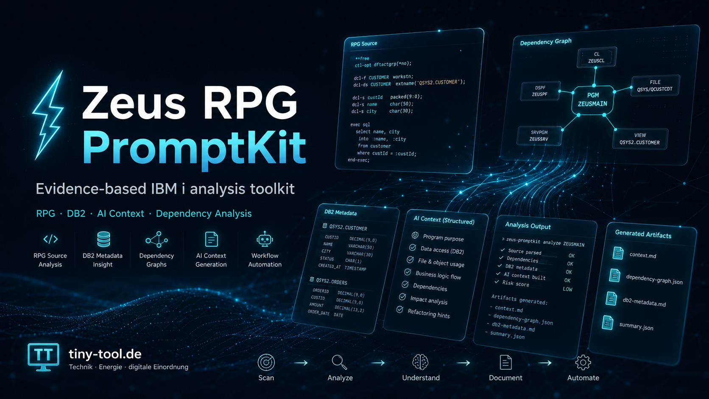

# Zeus RPG PromptKit




> **Evidence-first context builder for IBM i RPG, CL and DDS.**  
> CLI/MCP-first analysis, reviewable artifacts, AI-ready context and experimental local-only viewer support for controlled agent workflows.

**Tags:** `IBM i`, `AS/400`, `RPG`, `CL`, `DDS`, `DB2`, `Static Analysis`, `Impact Analysis`, `AI Context`, `Modernization`, `MCP`, `Agentic Coding`

---

## Language / Sprache

- [Deutsch](#deutsch)
- [English](#english)

---

# Deutsch

## Was ist Zeus RPG PromptKit?

**Zeus RPG PromptKit** ist ein Analyse- und Kontext-Toolkit für IBM i / AS/400-Landschaften.

Es hilft Teams dabei, RPG-, CL- und DDS-Quellen zu sammeln, zu normalisieren, strukturiert zu analysieren und daraus nachvollziehbare Artefakte für Menschen und KI-Assistenten zu erzeugen.

Zeus ist bewusst **kein Business-Code-Generator**. Das Projekt versteht sich als **Evidence Preparation Layer**: Es bereitet belastbaren Kontext auf, damit Entwickler:innen, Architekt:innen, QA, Modernisierungsteams und KI-gestützte Workflows nicht raten müssen, sondern auf überprüfbaren Informationen arbeiten.

Kurz gesagt:

- IBM i-Quellen holen oder lokale Quellen analysieren
- RPG, CL und DDS strukturiert scannen
- Programme, Dateien, Felder, Calls und Abhängigkeiten sichtbar machen
- DB2-Metadaten optional ergänzen
- Reports, Graphen, Prompts und JSON-Artefakte erzeugen
- Ergebnisse lokal prüfen, teilen oder in Tickets weiterverwenden
- KI-Assistenten über klare Safety-Regeln und Tool-Grenzen einbinden
- experimentell: lokale MCP-Integration für kontrollierte Agenten-Workflows

Zeus hängt an keinem bestimmten KI-Anbieter. Die erzeugten Artefakte können mit GitHub Copilot, ChatGPT, Claude, Grok, lokalen Modellen oder klassischen Reviews verwendet werden.

> **Projektstatus:** aktive Entwicklung. Schnittstellen, Workflows und MCP-Funktionen können sich zwischen Releases ändern.
>
> **Unterstützter Produktpfad:** CLI/MCP-first. `zeus serve` bleibt ein optionaler, lokaler, experimenteller Viewer für bereits erzeugte Artefakte.

---

## Warum dieses Projekt?

Viele IBM i-/AS/400-Landschaften enthalten wertvolle, gewachsene Fachlogik. Die Herausforderung ist selten nur „Code verstehen“, sondern:

- Welche Programme hängen zusammen?
- Welche Dateien, Felder und Tabellen sind betroffen?
- Welche Änderung hätte welche Nebenwirkungen?
- Welche DB2-Metadaten fehlen für eine belastbare Analyse?
- Was kann einer KI sicher gegeben werden?
- Wie bleibt ein Agent kontrolliert, auditierbar und read-orientiert?

Zeus versucht genau diese Lücke zu schließen: nicht durch Magie, sondern durch reproduzierbare Analyseartefakte, klare Safety-Level und einen lokalen, operatorfreundlichen Workflow.

---

## Wofür ist Zeus gedacht?

Typische Einsatzbereiche:

- Legacy-RPG-Programme schneller verstehen
- Impact-Analysen vor Änderungen durchführen
- Abhängigkeiten zwischen Programmen, Dateien und Tabellen sichtbar machen
- KI-Assistenten mit sauberem, überprüfbarem Kontext versorgen
- Modernisierungsvorhaben vorbereiten
- technische Dokumentation und Onboarding erleichtern
- Testideen, Deployment-Checklisten und Review-Artefakte erzeugen
- IBM i-Analysen lokal und reproduzierbar durchführen
- Agenten-Workflows über lokale MCP-Tools enger begrenzen

Zeus ist besonders hilfreich, wenn eine KI nicht einfach „auf gut Glück“ über alte RPG-Quellen reden soll, sondern nachvollziehbare Belege braucht.

---

## Was Zeus nicht macht

Zeus ersetzt keine fachliche Prüfung und keinen verantwortlichen Entwicklungsprozess.

Zeus:

- schreibt keinen Business-Code automatisch auf IBM i
- führt keine ungeprüften Änderungen auf produktiven Systemen aus
- ersetzt kein Review durch Entwickler:innen
- garantiert keine vollständige Analyse bei unvollständigen Quellen
- ist kein offizielles IBM-Produkt
- ist nicht mit IBM verbunden, gesponsert, unterstützt oder zertifiziert

Alle Änderungen, die aus Zeus-Ergebnissen abgeleitet werden, müssen durch Menschen bewertet, getestet und freigegeben werden.

---

## Safety-Modell

Der Grundsatz lautet:

> **Evidence first. AI second. Humans approve.**

Zeus arbeitet mit expliziten Safety-Leveln:

| Level | Bedeutung | Typische Aktion |
|---|---|---|
| `S0` | Lokal read-only | lokale Dateien lesen, Artefakte prüfen |
| `S1` | Lokaler Schreibzugriff | Reports, Bundles, Prompts oder Analyseartefakte erzeugen |
| `S2` | Remote read-only | IBM i / DB2 lesen, ohne produktive Daten zu verändern |
| `S3` | Kontrolliertes Schreiben | DML nur mit expliziter Freigabe und Guardrails |
| `S4` | Operator-gated High Risk | Bridge-, Apply- oder Compile-artige Aktionen, niemals implizit |

Praktisch bedeutet das:

- Fetch-, Query- und Analysefunktionen sind auf lesende Workflows ausgelegt.
- Änderungen entstehen zuerst lokal und werden als Diff, Plan oder Artefakt geprüft.
- KI-Assistenten dürfen Vorschläge machen, aber keine produktiven Systeme eigenmächtig verändern.
- Riskante Aktionen müssen explizit angezeigt, begründet und freigegeben werden.
- Generierte Artefakte können sensible Fachlogik enthalten und sollten bewusst geteilt werden.
- Für externe Reviews kann `--safe-sharing` genutzt werden.

---

## Projektneutrale Knowledge-Pipeline

Zeus bereitet eine sichere, projektneutrale Knowledge-Pipeline für zukünftige KI-gestützte Modernisierungs-Workflows vor.

Der aktuelle Stand ist bewusst nur ein Skeleton mit klaren Vertragsgrenzen unter `src/knowledge/`:

- `raw/` für sensitive Roh-Evidenz
- `sanitized/` für redaktierte Kandidaten
- `final/` für projektneutrale Katalog-Verträge
- `privacy/` für fail-closed Privacy-Gates

Wichtig:

- Rohdaten oder source-abgeleitete Projektdaten werden **nie** als wiederverwendbares Toolkit-Wissen behandelt.
- CLI-/MCP-/API-Exposure bleibt deaktiviert, bis ein finaler Katalog die Privacy-Validierung bestanden hat.
- Der frühere experimentelle DDDL-/Template-/Registry-Pfad wurde zurückgesetzt.
- DDDL bleibt nur ein lokales Roh-Austauschformat für interne Tooling-Schritte, keine sichere wiederverwendbare Knowledgebase.

### Lokale Known Facts (explizites Opt-in)

Zusätzlich zur projektneutralen Knowledge-Pipeline kann Zeus profilbezogene, rein lokale Known Facts in eine Analyse einblenden.

Wichtig:

- Known Facts bleiben bewusst lokal unter `config/local-only/known-facts/<profile>.json`
- sie werden nur mit explizitem Opt-in über `--with-known-facts` geladen
- fehlende oder abgelaufene Stores werden sichtbar markiert statt still geraten
- secret-artige Inhalte werden fail-closed abgewiesen
- diese lokalen Fakten sind **nicht** Teil der projektneutralen Toolkit-Knowledge-Pipeline

Beispiel:

```powershell
node .\cli\zeus.js analyze --source .\rpg_sources --program ORDERPGM --profile default --out .\output --with-known-facts
```

---

## Lokale MCP-Unterstützung (experimentelles MVP)

Dieses Repository enthält eine **lokale MCP-Server-Integration** für kontrollierten Tool-Zugriff über `stdio`.

Ziel ist nicht „Agent darf alles“, sondern:

- lokale Prozessgrenze statt Remote-Service
- read-orientierter Zugriff als Default
- explizite Tool-Allowlist
- Redaction vor Ausgabe und Audit
- nachvollziehbarer lokaler Audit-Trail
- deterministische Fehler für Tool-Aufrufe, Timeouts und zu große Antworten

### MCP-Start

```bash
node cli/zeus.js mcp serve --verbose
```

Ohne `--allow-tools` exponiert MCP die sichere Default-Oberfläche (health, doctor, profiles, analyze, searches, queries etc. — siehe Policy).
Auch read-only DB2/IBM-i-Tools bleiben explizites Opt-in, weil read-only trotzdem sensible Daten offenlegen kann.

Empfohlen: Tool-Oberfläche für echte Workflows explizit begrenzen:

```bash
node cli/zeus.js mcp serve --verbose --allow-tools zeus.health,zeus.version,zeus.profiles,zeus.doctor,zeus.help,zeus.onboarding,zeus.analyze,zeus.workflow,zeus.bundle,zeus.search-source,zeus.field-search,zeus.resolve-object,zeus.inspect-object,zeus.query-table,zeus.query-sql,zeus.impact,zeus.assess-risk,zeus.generate-test,zeus.generate-checklist,zeus.qa,zeus.validate-rpg-sql,zeus.analyses,zeus.fetch-member,zeus.diff,zeus.copy-to-workspace,zeus.joblog,zeus.docs-generate-catalog,zeus.serve,zeus.test-run
```

### MCP-Sicherheitsrahmen

| Bereich | Verhalten |
|---|---|
| Transport | lokal über `stdio` |
| Policy | minimale sichere Default-Oberfläche plus explizite Tool-Allowlist |
| Allowlist | `--allow-tools` |
| Redaction | Maskierung von Response- und Error-Payloads |
| Audit | lokales append-only JSONL unter `.local/mcp/audit/mcp-audit.jsonl` |
| Guardrails | Timeouts, Antwortgrößenlimits, deterministische Fehlercodes |
| Pfade | lokale Pfade müssen innerhalb des Workspace bleiben, auch absolute Pfade |

### Aktuelle MCP-Tool-Oberfläche

Die MCP-Tool-Oberfläche ist experimentell und kann sich zwischen Releases/Versionen ändern.  
Die verbindliche Referenz ist `docs/tool-catalog.md`.

Hinweise:

- `zeus.knowledge` ist nicht Teil der aktuellen Tool-Oberfläche.
- Audit-Dateien unter `.local/mcp/audit/` sind lokal, disposabel und potenziell sensibel.
- Für KI-Clients immer nur die kleinste notwendige Tool-Allowlist freigeben.

### MCP Write-Guardrails

`zeus.write-sql` ist besonders strikt:

- `operation=plan` ist nicht-mutierend.
- `operation=apply` ist blockiert, solange `ZEUS_MCP_ENABLE_WRITES` nicht explizit aktiviert ist.
- `operation=apply` benötigt ein bestätigendes Token über `ZEUS_MCP_WRITE_CONFIRM_TOKEN` und einen passenden `confirmToken` im Tool-Input.
- Produktionsprofile bleiben für Apply hart blockiert.
- Allowlist-Regeln für Tabellen können erzwungen werden.
- `UPDATE` und `DELETE` ohne top-level `WHERE` werden abgelehnt.
- triviale oder breite Prädikate wie `WHERE 1=1` werden abgelehnt.
- Row-Safety-Limits können über Profil-/Runtime-Konfiguration begrenzt werden.

Bridge-Funktionen bleiben im MCP-Kontext bewusst operator-gated. Plan-, Report- und Dry-Run-artige Operationen sind der richtige Standardpfad.

---

## Onboarding zu einem neuen IBM i System

Siehe die dedizierte Anleitung: [`docs/quickstart/onboarding-new-ibm-i.md`](docs/quickstart/onboarding-new-ibm-i.md)

Sie behandelt:
- Verbindungsaufbau (Profile + Umgebungsvariablen)
- Suche nach Source-Code (QRPGLESRC, QCLSRC etc.)
- PGM-Objekte, Table-Objekte, DDL
- Beschaffung von Metadaten und Daten
- Die ersten sicheren Kommandos (`doctor --probe`, `resolve-object`, `inspect-object`, `fetch`, `analyze`)

## Quickstart: Demo in 5 Minuten (lokal)

### 1. Voraussetzungen

- Node.js 20 oder neuer
- Java 11 oder neuer, wenn JT400-/DB2-nahe Funktionen genutzt werden sollen
- optional: IBM i SSH/SFTP-Zugang für `fetch`
- optional: DB2-/JT400-Zugriff für Metadaten, Diagnoseabfragen und Testdaten

### 2. Installation

```bash
git clone https://github.com/gzeuner/zeus-rpg-promptkit.git
cd zeus-rpg-promptkit
npm install
```

### 3. Synthetisches Demo ausführen

```bash
npm run demo:run
```

### 4. Artefakte prüfen

Typische Demo-Artefakte:

```text
examples/demo-rpg-mini-system/output-baseline/report.md
examples/demo-rpg-mini-system/output-baseline/architecture-report.md
examples/demo-rpg-mini-system/output-baseline/ai-knowledge.json
examples/demo-rpg-mini-system/output-baseline/dependency-graph.mmd
```

Optionaler lokaler Viewer:

```bash
node cli/zeus.js serve --source-output-root ./examples/demo-rpg-mini-system/output-baseline
```

Danach öffnen:

```text
http://localhost:4782
```

### 5. KI-Session-Prompt aus Demo-Artefakten erzeugen

```bash
npm run demo:prompt
```

---

## Quickstart: eigene lokale Quellen analysieren

```bash
# 1. Dependencies installieren
npm install

# 2. Lokalen RPG-Quellbaum analysieren
node cli/zeus.js analyze \
  --source ./rpg_sources \
  --program ORDERPGM \
  --out ./output \
  --optimize-context
```

Wichtige Ergebnisdateien:

```text
output/ORDERPGM/report.md
output/ORDERPGM/architecture-report.md
output/ORDERPGM/ai_prompt_documentation.md
output/ORDERPGM/canonical-analysis.json
output/ORDERPGM/ai-knowledge.json
output/ORDERPGM/dependency-graph.mmd
output/ORDERPGM/analyze-run-manifest.json
```

Optionaler lokaler Viewer für vorhandene Artefakte:

```bash
node cli/zeus.js serve --source-output-root ./output
```

---

## Quickstart: IBM i-Fetch mit Profilen

```powershell
# 1. Lokales Profil anlegen
Copy-Item config/profiles.example.json config/local-only/profiles.json

# 2. Profil bearbeiten
# config/local-only/profiles.json

# 3. Env-Variablen laden
. .\config\load-env.ps1 -Environment project

# Bei ExecutionPolicy-Problemen nur fuer diese Session:
# Set-ExecutionPolicy -Scope Process -ExecutionPolicy Bypass -Force

# 4. Setup pruefen
node .\cli\zeus.js doctor --profile dev --probe --show-resolved

# 5. Objekt-/Tabellenname sauber aufloesen
node .\cli\zeus.js resolve-object --profile readonly-db2 --table APP_TABLE_00 --require-column CASE_ID

# 6. Quellen holen
node .\cli\zeus.js fetch --profile sftp-fetch

# 7. Quellen analysieren
node .\cli\zeus.js analyze --profile dev --source .\rpg_sources --program ORDERPGM --out .\output --optimize-context
```

Ohne IBM i-Anbindung können RPG-, CL- und DDS-Dateien einfach in `rpg_sources/` abgelegt und direkt mit `analyze` verarbeitet werden.
Empfohlene Profilnamen im Public-Contract: `dev`, `demo`, `sftp-fetch`, `readonly-db2`, `combined-fetch-and-query` (Legacy-Aliase `sample-*` bleiben unterstützt).

Für Mehrsystem-Setups können Profile benannte `systems` mit `displayName`, `systemName` und `aliases` definieren.
Damit bleibt auch bei Host-Alias, DNS-CNAME oder abweichendem `CURRENT_SERVER` klar, welche Verbindung für Fetch, Metadaten und Testdaten gedacht ist.
`doctor --profile <name> --probe --show-resolved` zeigt diese Zuordnung explizit an.

---

## Optionalen lokalen Viewer nutzen

Der unterstützte Ablauf bleibt Shell-Env laden -> `doctor` -> CLI/MCP-Kommandos -> Artefakte.  
`zeus serve` ist nur ein optionaler, lokaler, experimenteller Viewer für bereits vorhandene Ausgaben.

Lokalen Viewer starten:

```bash
node cli/zeus.js serve --source-output-root ./output
```

Danach im Browser öffnen:

```text
http://127.0.0.1:4782
```

Wofür der Viewer nützlich ist:

- vorhandene Reports, Graphen, Prompt-Artefakte und andere lokale Outputs im Browser durchsehen
- lokale Hilfsansichten für Profil-/Feld-Metadaten und `doctor`-Diagnostik nutzen
- bei Bedarf den lokalen AI Session Starter als Hilfsansicht verwenden

Wichtig zur Grenze:

- Die Browser-Oberfläche ist nicht der primäre Onboarding-, Konfigurations- oder Ausführungspfad.
- Shell-Env-Loading bleibt verbindlich; der Viewer ersetzt `config/load-env.*` nicht.
- Die Browser-UI führt nur allowlistete Aktionen aus und ist kein allgemeiner Command-Runner.
- Echte Remote-Checks und Connection-Verifikation laufen weiterhin über CLI- oder MCP-Kommandos wie `doctor`, `resolve-object`, `query-table` oder `fetch`.
- Fetch-, DB2- und Objekt-Discovery im Browser bleiben bewusst eingeschränkt oder preview-first.

---

## Wichtige CLI-Befehle

Die verbindliche Referenz ist `docs/tool-catalog.md`.

| Befehl | Safety | Zweck |
|---|---:|---|
| `doctor` | `S0` | Umgebung, Profile, Java und Env-Verträge prüfen |
| `fetch` | `S2` | IBM i-Quellen per SFTP, JT400 oder FTP holen |
| `analyze` | `S1` | RPG/CL/DDS scannen und Analyseartefakte erzeugen |
| `workflow` | `S1` | vordefinierte Analyse- und Bundle-Presets ausführen |
| `bundle` | `S1` | Analyseartefakte für Review oder Sharing paketieren |
| `impact` | `S1` | Reverse-Impact-Analysen nach Programm, Feld oder Ziel erzeugen |
| `assess-risk` | `S1` | Risiko-orientierte Zusammenfassung erzeugen |
| `generate-test` | `S1` | Testpläne oder Test-Templates erzeugen |
| `generate-checklist` | `S1` | Deployment- und Change-Checklisten erzeugen |
| `query-table` | `S2` | DB2-Tabellenmetadaten lesen |
| `query-sql` | `S2` | read-only SQL ausführen (`SELECT` / `WITH`) |
| `resolve-object` | `S2` | SQL-Langname, Systemname und Schema read-only auflösen |
| `joblog` | `S2` | IBM i-Joblog-Informationen lesen |
| `field-search` | `S0/S2` | Feld- und Tabellenverwendung lokal oder remote suchen |
| `search-source` | `S0` | lokale Source-Suche durchführen |
| `copy-to-workspace` | `S1` | gefetchte Quellen in den Workspace kopieren |
| `diff` | `S2` | lokale Member mit IBM i-Version vergleichen |
| `serve` | `S0` | optionalen lokalen Artefakt-Viewer starten |
| `qa` | `S1` | QA-Checks als Markdown, JSON oder Jira-Format rendern |
| `inspect-object` | `S2` | IBM i-Objektmetadaten lesen |
| `test-run` | `S2/S1` | Test-Snapshots und Rollback-Hinweise erzeugen |
| `upsert` / `insert` / `update` | `S3` | DML mit Guardrails, nur nach expliziter Freigabe |
| `bridge` | `S4` | operator-gated Bridge-Planung, experimentell |
| `mcp` | `S0` | lokalen MCP-Server starten |
| `docs:generate-catalog` | `S0` | Tool-Katalog aus CLI-Metadaten regenerieren |

Beispiele:

```bash
node cli/zeus.js doctor --profile dev --show-resolved
node cli/zeus.js doctor --profile dev --probe --show-resolved
node cli/zeus.js resolve-object --profile readonly-db2 --table APP_TABLE_00 --require-column CASE_ID --include-row-count
node cli/zeus.js analyze --source ./rpg_sources --program ORDERPGM --out ./output
node cli/zeus.js impact --field RECORD_ID --program ORDERPGM --source ./rpg_sources --out ./output
# optionaler lokaler Viewer:
node cli/zeus.js serve --source-output-root ./output
node cli/zeus.js docs:generate-catalog
```

---

## Workflow-Presets

```bash
node cli/zeus.js workflow --preset onboarding --source ./rpg_sources --program ORDERPGM
node cli/zeus.js workflow --preset architecture-review --source ./rpg_sources --program ORDERPGM
node cli/zeus.js workflow --preset security-review --source ./rpg_sources --program ORDERPGM
node cli/zeus.js workflow --preset modernization-review --source ./rpg_sources --program ORDERPGM
node cli/zeus.js workflow --preset dependency-risk --source ./rpg_sources --program ORDERPGM
node cli/zeus.js workflow --preset refactoring-review --source ./rpg_sources --program ORDERPGM
node cli/zeus.js workflow --preset test-generation-review --source ./rpg_sources --program ORDERPGM
```

Empfohlene AI-Arbeitsfolge:

1. `doctor` ausführen
2. bei Bedarf und Freigabe `fetch` nutzen
3. mit `doctor --probe` und `resolve-object` Remote-Ziele read-only verifizieren
4. `analyze` oder `workflow --preset ...` starten
5. mit `query-table`, `query-sql`, `joblog`, `field-search`, `search-source` oder `inspect-object` Evidenz vertiefen
6. mit `impact`, `assess-risk`, `generate-test`, `generate-checklist` oder `qa` planen und validieren
7. mit generierten Artefakten und `bundle` reviewfähige Ergebnisse erzeugen; `serve` nur optional für lokale Sichtung nutzen
8. `upsert`, `insert`, `update` oder `bridge` nur nach expliziter menschlicher Freigabe verwenden

---

## Profile und Umgebungsvariablen

### Grundprinzip

Credentials gehören nicht ins Repository.

- `config/local-only/profiles.json` ist für lokale Profile gedacht.
- Diese Datei sollte per `.gitignore` ausgeschlossen bleiben.
- Passwörter und Tokens werden über Env-Variablen gesetzt.
- Profile dürfen Platzhalter wie `${env:ZEUS_DB_PASSWORD}` enthalten.
- Die echten Werte lädt immer der User in der Shell-Session.

### Profil anlegen

```bash
cp config/profiles.example.json config/local-only/profiles.json
```

Windows PowerShell:

```powershell
Copy-Item config/profiles.example.json config/local-only/profiles.json
```

Danach prüfen:

```bash
node cli/zeus.js doctor --profile dev --show-resolved
```

Empfohlene Startprofile:

- `dev` fuer taegliche Entwicklung
- `demo` fuer lokale Smoke-Checks ohne IBM i
- `sftp-fetch` fuer reinen Fetch-Workflow
- `readonly-db2` fuer geschuetzte Read-only Queries
- `combined-fetch-and-query` fuer End-to-End Beispiele

Legacy `sample-*` Profile bleiben als Rueckwaertskompatibilitaets-Aliase erhalten.

### Typische Env-Variablen

IBM i Fetch:

```powershell
$env:ZEUS_FETCH_HOST = "myibmi.example.com"
$env:ZEUS_FETCH_USER = "MYUSER"
$env:ZEUS_FETCH_PASSWORD = "secret"
$env:ZEUS_FETCH_SOURCE_LIB = "SOURCEN"
$env:ZEUS_FETCH_IFS_DIR = "/home/zeus/rpg"
$env:ZEUS_FETCH_OUT = "./rpg_sources"
```

DB2-Metadaten:

```powershell
$env:ZEUS_DB_HOST = "myibmi.example.com"
$env:ZEUS_DB_USER = "MYUSER"
$env:ZEUS_DB_PASSWORD = "secret"
$env:ZEUS_DB_DEFAULT_SCHEMA = "MYLIB"
```

Weitere häufige Variablen:

| Variable | Zweck |
|---|---|
| `ZEUS_SOURCE_ROOT` | Source-Root für Profil-Platzhalter |
| `ZEUS_OUTPUT_ROOT` | Output-Root für Analyseartefakte |
| `ZEUS_FETCH_*` | IBM i Fetch-Konfiguration |
| `ZEUS_DB_*` | DB2-Verbindung |
| `ZEUS_METADATA_DB_*` | optional separater DB2-Endpunkt für Metadaten |
| `ZEUS_TESTDATA_DB_*` | optional separater DB2-Endpunkt für Testdaten |
| `ZEUS_MCP_ENABLE_WRITES` | explizites Opt-in für MCP-Write-Apply-Pfade |
| `ZEUS_MCP_WRITE_CONFIRM_TOKEN` | Bestätigungstoken für MCP-Write-Apply-Pfade |

---

## Analyseartefakte

Nach einem `analyze`-Lauf liegen die Ergebnisse typischerweise unter:

```text
output/<PROGRAM>/
```

Wichtige Dateien:

| Datei | Inhalt |
|---|---|
| `report.md` | Programm-Zusammenfassung |
| `architecture-report.md` | Struktur, Call-Tree, Abhängigkeiten |
| `canonical-analysis.json` | vollständiges Entitäts- und Evidenzmodell |
| `ai-knowledge.json` | token-optimierter KI-Kontext für genau diesen Analyse-Run, **keine** persistente projektneutrale Toolkit-Knowledgebase |
| `ai_prompt_documentation.md` | fertiger Prompt für Erklärung und Dokumentation |
| `dependency-graph.mmd` | Mermaid-Abhängigkeitsgraph |
| `analyze-run-manifest.json` | Laufprotokoll und Artefaktübersicht |

Lokale UI starten:

```bash
node cli/zeus.js serve --source-output-root ./output
```

---

## Dokumentation

Die Dokumentation ist Safety-first und KI-ready aufgebaut.

| Dokument | Zweck |
|---|---|
| `docs/index.md` | zentraler Dokumentations-Hub |
| `docs/tool-catalog.md` | verbindliche Command-, Safety- und Scope-Referenz |
| `docs/ai/session-prompt.md` | Session-Bootstrap für Evidence-First-KI-Workflows |
| `docs/quickstart/5-minutes.md` | schnellster operativer Einstieg |
| `docs/mcp/operator-guide.md` | lokaler MCP-Betrieb, Policy-Grenzen und Troubleshooting |
| `docs/safety/` | Safety-Guidance, Governance und Sharing |
| `docs/cli/` | CLI-Referenz und Beispiele |
| `docs/workflows/` | geführte Analyse- und Agenten-Workflows |
| `docs/sql/` | reproduzierbare SQL-Discovery-Skripte |
| `docs/internal/` | interne Verträge, Modelle und technische Details |

Tool-Katalog nach CLI-Änderungen aktualisieren:

```bash
node cli/zeus.js docs:generate-catalog
# oder
node cli/zeus.js docs generate-catalog
```

Optional mit JSON-Projektion:

```bash
node cli/zeus.js docs:generate-catalog --json-output docs/tool-catalog.json
```

---

## Architekturüberblick

### Node.js CLI

Haupteinstiegspunkt:

```text
cli/zeus.js
```

Zentrale Bereiche:

| Bereich | Aufgabe |
|---|---|
| `src/collector/` | Source Discovery |
| `src/scanner/` | RPG-, CL-, DDS- und Dependency-Scanner |
| `src/context/` | kanonisches Analysemodell und KI-Kontext |
| `src/dependency/` | Dependency- und Call-Graphen |
| `src/report/` | Markdown- und Architekturberichte |
| `src/prompt/` | Prompt-Rendering und Prompt-Verträge |
| `src/security/` | Secret Masking und Redaction |
| `src/viewer/` | lokale Browser-Ansicht |
| `src/impact/` | Reverse-Impact-Analysen |
| `src/analyze/` | Analysepipeline und Stage Registry |
| `src/java/` | Java Runtime Bridge |
| `src/mcp/` | lokale MCP-Server-/Policy-Integration |

### Java-Helfer

Für IBM i- und DB2-nahe Aufgaben gibt es Java-Helfer unter `java/`.

Typische Aufgaben:

- Source-Member auflisten und exportieren
- IFS-Verzeichnisbäume herunterladen
- read-only DB2-Diagnoseabfragen ausführen
- Tabellen, Spalten, Keys und Trigger exportieren
- Views, Aliase und externe Objekte auflösen
- maskierte Beispiel-Datensätze exportieren
- Source-Member auf IBM i durchsuchen

---

## Tests

```bash
npm test
npm run test:unit
npm run test:smoke
npm run test:contract
npm run test:corpus
npm run test:benchmark
```

Zusätzlich für das synthetische Demo:

```bash
npm run demo:run
npm run demo:prompt
npm run demo:safety-check
```

Die Tests decken unter anderem Scanner, Analyseverträge, Runtime-Konfiguration, Profile, Secret Masking, lokale UI, MCP-Server/stdio-Transport und Workflow-Verträge ab.

---

## Best Practices

- Erst Evidenz erzeugen, dann KI fragen.
- `docs/tool-catalog.md` als verbindliche Command- und Safety-Referenz behandeln.
- Lokale Profile und Credentials strikt außerhalb des Repositories halten.
- Encoding früh normalisieren, idealerweise UTF-8.
- Erst `report.md` und `architecture-report.md` lesen, dann JSON-Artefakte vertiefen.
- DB2-Metadaten einbeziehen, wenn Tabellenlogik, Constraints, Trigger oder dynamisches SQL relevant sind.
- Unaufgelöste Referenzen nicht ignorieren.
- KI-Antworten immer gegen `canonical-analysis.json`, Reports und DB2-Metadaten prüfen.
- MCP-Tools nur minimal allowlisten.
- Audit-Dateien und generierte Artefakte als potenziell sensibel behandeln.
- Lokale Arbeitsdaten unter `.local/`, `output/` oder `.zeus/` sind keine Knowledgebase. Sie können sensible Analyse-, Audit- oder Scratch-Daten enthalten. Siehe `docs/safety/local-workspace-policy.md`.
- Für externe Weitergabe `--safe-sharing` nutzen.

---

## Anti-Pattern

Bitte vermeiden:

- komplette Rohquellen unstrukturiert in KI-Chats kippen
- DB2-Metadaten weglassen, obwohl Datenlogik kritisch ist
- Encoding-Mischmasch im Source-Tree ignorieren
- Beispiel-Testdaten als Produktionswahrheit interpretieren
- unaufgelöste Referenzen „wegdenken“
- generierte KI-Antworten ohne Review übernehmen
- MCP-Clients mit zu breiter Tool-Allowlist starten
- produktive IBM i-Systeme durch KI direkt ändern lassen

---

## Verantwortung, KI-Einsatz, Gewährleistung und Haftung

Zeus RPG PromptKit ist ein freies Open-Source-Projekt. Es wird unentgeltlich bereitgestellt und soll Entwickler:innen dabei helfen, IBM i-/AS/400-Quellen, DB2-Metadaten und Abhängigkeiten besser zu verstehen und für Reviews oder KI-gestützte Workflows aufzubereiten.

Die Software, Dokumentation, Beispiele, Prompts und erzeugten Artefakte werden ohne Gewährleistung bereitgestellt. Sie können Fehler enthalten, unvollständig sein oder für eine konkrete Umgebung nicht passen. Es gibt keine Zusicherung, dass die Ergebnisse vollständig, richtig, aktuell, sicher, dauerhaft verfügbar oder für einen bestimmten Zweck geeignet sind. Die Nutzung erfolgt auf eigene Verantwortung.

Wer Zeus RPG PromptKit einsetzt, bleibt selbst verantwortlich für:

- Konfiguration, Profile, Zugangsdaten und Umgebungsvariablen
- Auswahl und Ausführung von Befehlen, SQL-Abfragen und Workflows
- den Umgang mit produktiven Systemen, Fachlogik und sensiblen Daten
- Prüfung, Bewertung und Nutzung der erzeugten Reports, Prompts und Analyseartefakte
- Tests, Code-Reviews, Freigaben, Deployments und Betrieb eigener Änderungen
- den kontrollierten Einsatz von KI-Assistenten, Agenten, Auto-Approve-Funktionen oder anderen Automatisierungen

KI-gestützte Werkzeuge können helfen, aber sie können auch falsche, unvollständige oder riskante Vorschläge erzeugen. Weder eine KI noch Zeus RPG PromptKit treffen verbindliche Entscheidungen. Änderungen an Code, Daten, Konfigurationen oder Systemen müssen immer von den verantwortlichen Menschen geprüft, getestet und freigegeben werden.

Soweit gesetzlich zulässig, übernehmen Autor:innen, Maintainer:innen und Beitragende keine Haftung für Schäden, Datenverluste, Betriebsunterbrechungen, Sicherheitsvorfälle, fehlerhafte Analysen, falsche KI-Ausgaben oder sonstige Folgen, die aus der Nutzung oder Nichtnutzbarkeit dieses Projekts entstehen.

Dieser Haftungsausschluss gilt nicht, soweit eine Haftung gesetzlich zwingend vorgeschrieben ist, insbesondere bei Vorsatz, grober Fahrlässigkeit, Verletzung von Leben, Körper oder Gesundheit, arglistig verschwiegenen Mängeln, übernommenen Garantien oder zwingender Produkthaftung.

Wer dieses Projekt verändert, weitergibt, in eigene Produkte oder Dienstleistungen integriert, kommerziell nutzt oder Dritten bereitstellt, ist selbst dafür verantwortlich, die jeweils geltenden Lizenz-, Sicherheits-, Prüf-, Informations-, Gewährleistungs- und Haftungspflichten einzuhalten.

Dieser Abschnitt ergänzt die Apache License 2.0, ersetzt sie aber nicht. Maßgeblich bleiben die Lizenzbedingungen in der Datei `LICENSE`.

---

## Marken- und Herstellerhinweis

IBM, IBM i, AS/400, DB2, RPG, CL, DDS, JTOpen, JT400 und weitere in diesem Projekt genannte Produktnamen können Marken oder eingetragene Marken ihrer jeweiligen Eigentümer sein.

Dieses Projekt ist ein unabhängiges Open-Source-Projekt und steht in keiner Verbindung zu IBM oder anderen Herstellern. Es wird weder von ihnen unterstützt, gesponsert, empfohlen noch zertifiziert. Alle Markenrechte liegen bei ihren jeweiligen Eigentümern.

---

## Lizenz

Dieses Projekt ist unter der **Apache License 2.0** lizenziert.

Siehe:

```text
LICENSE
```

Die Apache License 2.0 ist eine permissive Open-Source-Lizenz. Sie erlaubt Nutzung, Änderung und Weiterverteilung, enthält aber Bedingungen zu Lizenzhinweisen, Copyright-Hinweisen und ggf. NOTICE-Dateien. Außerdem enthält sie eine ausdrückliche Patentlizenz.

### Hinweis zu JTOpen / JT400

Für IBM i-/DB2-nahe Funktionen kann JTOpen / IBM Toolbox for Java erforderlich sein.

JTOpen / JT400 ist nicht Bestandteil dieses Projekts und wird nicht mit Zeus RPG PromptKit ausgeliefert. Es wird bei Bedarf vom User lokal bereitgestellt oder über die jeweilige Projekt-/Build-Konfiguration eingebunden.

Weitere Informationen: https://github.com/IBM/JTOpen

---

# English

## What is Zeus RPG PromptKit?

**Zeus RPG PromptKit** is an analysis and context preparation toolkit for IBM i / AS/400 environments.

It helps teams collect, normalize and analyze RPG, CL and DDS sources, extract dependencies, enrich results with DB2 metadata and produce reusable artifacts for developers, architects, QA teams, modernization projects and AI-assisted workflows.

Zeus is deliberately **not a business-code generator**. It is an **Evidence Preparation Layer**: it creates structured, reviewable and reusable context so humans and AI assistants can work from facts instead of guesswork.

In short, Zeus helps you:

- fetch or analyze IBM i source code locally
- scan RPG, CL and DDS sources
- identify programs, files, fields, calls and dependencies
- optionally enrich results with DB2 metadata
- generate reports, graphs, prompts and JSON artifacts
- review results locally, share them safely or attach them to tickets
- bind AI assistants to explicit safety and scope rules
- experimentally expose a local MCP tool surface for controlled agent workflows

Zeus is not tied to a specific AI provider. The generated artifacts can be used with GitHub Copilot, ChatGPT, Claude, Grok, local models or plain human reviews.

> **Project status:** active development. Interfaces, workflows and MCP features may change between releases.
>
> **Supported product path:** CLI/MCP-first. `zeus serve` remains an optional, local-only, experimental viewer for already generated artifacts.

---

## Why use this project?

Many IBM i / AS/400 systems contain valuable, long-lived business logic. The hard part is rarely just “read the code”. More often the real questions are:

- Which programs depend on each other?
- Which files, fields and tables are affected?
- What could a change break?
- Which DB2 metadata is required for a reliable conclusion?
- What can safely be given to an AI assistant?
- How can an agent remain controlled, auditable and read-oriented?

Zeus addresses this gap with reproducible analysis artifacts, explicit safety levels and a local, operator-friendly workflow.

---

## What is Zeus for?

Typical use cases:

- understand legacy RPG programs faster
- run impact analyses before changes
- make dependencies between programs, files and tables visible
- provide grounded context to AI assistants
- prepare modernization work
- support documentation and onboarding
- generate test ideas, deployment checklists and review artifacts
- keep IBM i analysis local and reproducible
- restrict agent workflows through local MCP tools

Zeus is especially useful when an AI assistant should not reason blindly over old RPG sources, but should work from structured evidence.

---

## What Zeus does not do

Zeus does not replace responsible engineering, review or testing.

Zeus does not:

- automatically write business code to IBM i
- perform unreviewed changes on production systems
- replace developer review
- guarantee complete analysis when sources are incomplete
- act as an official IBM product
- have any affiliation, sponsorship, support or certification by IBM

All changes derived from Zeus output must be reviewed, tested and approved by humans.

---

## Safety model

The operating principle is:

> **Evidence first. AI second. Humans approve.**

Zeus uses explicit safety levels:

| Level | Meaning | Typical action |
|---|---|---|
| `S0` | Local read-only | read local files, inspect generated artifacts |
| `S1` | Local write | create reports, bundles, prompts or analysis artifacts |
| `S2` | Remote read-only | read IBM i / DB2 without mutations |
| `S3` | Controlled write | DML only with explicit approval and guardrails |
| `S4` | Operator-gated high risk | bridge/apply/compile-style operations, never implicit |

In practice:

- Fetch, query and analysis workflows are designed around read-oriented operations.
- Changes are prepared locally first and reviewed as diffs, plans or artifacts.
- AI assistants may suggest changes, but must not modify production systems on their own.
- Risky actions must be shown, explained and explicitly approved.
- Generated artifacts may contain sensitive business logic and should be shared deliberately.
- Use `--safe-sharing` where appropriate for external review.

---

## Project-neutral knowledge pipeline

Zeus is preparing a safe, project-neutral knowledge pipeline for future AI-assisted modernization workflows.

The current implementation is intentionally only a skeleton with explicit contract boundaries under `src/knowledge/`:

- `raw/` for sensitive raw evidence
- `sanitized/` for redacted candidates
- `final/` for project-neutral catalog contracts
- `privacy/` for fail-closed privacy gates

Important:

- Raw or source-derived project data is **never** treated as reusable toolkit knowledge.
- CLI/MCP/API exposure remains disabled until a final catalog passes privacy validation.
- The former experimental DDDL/template/registry path has been reset.
- DDDL remains a local raw interchange format for internal tooling only, not a safe reusable knowledgebase.

### Local known facts (explicit opt-in)

In addition to the project-neutral knowledge pipeline, Zeus can fold profile-scoped local known facts into an analysis run.

Important:

- known facts stay intentionally local at `config/local-only/known-facts/<profile>.json`
- they are loaded only via explicit opt-in with `--with-known-facts`
- missing or expired stores are surfaced explicitly instead of being guessed silently
- secret-like content is rejected fail-closed
- these local facts are **not** part of the project-neutral reusable toolkit knowledge pipeline

Example:

```bash
node ./cli/zeus.js analyze --source ./rpg_sources --program ORDERPGM --profile default --out ./output --with-known-facts
```

---

## Local MCP support (experimental MVP)

This repository includes a **local MCP server integration** for controlled tool access over `stdio`.

The goal is not “let the agent do everything”. The goal is:

- local process boundary instead of a remote service
- read-oriented access by default
- explicit tool allowlisting
- redaction before response and audit emission
- traceable local audit trail
- deterministic errors for tool calls, timeouts and oversized responses

### Start MCP server

```bash
node cli/zeus.js mcp serve --verbose
```

Without `--allow-tools`, MCP exposes the safe default surface (health, doctor, profiles, analyze, search, queries, review tools etc. — see mcpPolicy.js).
Remote read-only DB2 / IBM i tools still require explicit opt-in because read-only access can still expose sensitive data.

Recommended: restrict the exposed tool surface explicitly for real workflows:

```bash
node cli/zeus.js mcp serve --verbose --allow-tools zeus.health,zeus.version,zeus.profiles,zeus.doctor,zeus.help,zeus.onboarding,zeus.analyze,zeus.workflow,zeus.bundle,zeus.search-source,zeus.field-search,zeus.resolve-object,zeus.inspect-object,zeus.query-table,zeus.query-sql,zeus.impact,zeus.assess-risk,zeus.generate-test,zeus.generate-checklist,zeus.qa,zeus.validate-rpg-sql,zeus.analyses,zeus.fetch-member,zeus.diff,zeus.copy-to-workspace,zeus.joblog,zeus.docs-generate-catalog,zeus.serve,zeus.test-run
```

### MCP security posture

| Area | Behavior |
|---|---|
| Transport | local `stdio` |
| Policy | safe default surface (see mcpPolicy.js) plus explicit --allow-tools |
| Allowlist | `--allow-tools` |
| Redaction | response and error payload masking |
| Audit | local append-only JSONL at `.local/mcp/audit/mcp-audit.jsonl` |
| Guardrails | timeouts, response-size limits, deterministic error codes |
| Paths | local paths must remain inside the workspace, including absolute paths |

### Current MCP tool surface

The MCP tool surface is experimental and may change between releases.  
The authoritative reference is `docs/tool-catalog.md`.

Notes:

- `zeus.knowledge` is not part of the current tool surface.
- audit files under `.local/mcp/audit/` are local, disposable and potentially sensitive.
- for AI clients, always allowlist the minimum required tool set per task.

### MCP write guardrails

`zeus.write-sql` is intentionally strict:

- `operation=plan` is non-mutating.
- `operation=apply` is blocked unless `ZEUS_MCP_ENABLE_WRITES` is explicitly enabled.
- `operation=apply` requires `ZEUS_MCP_WRITE_CONFIRM_TOKEN` and a matching `confirmToken` input.
- Production profiles remain hard-blocked for apply.
- Table allowlist policies can be enforced.
- `UPDATE` and `DELETE` without a top-level `WHERE` clause are rejected.
- Trivial or broad predicates such as `WHERE 1=1` are rejected.
- Row-safety limits can be enforced through profile/runtime configuration.

Bridge capabilities remain deliberately operator-gated in MCP. Plan, report and dry-run style operations are the safe default path.

---

## Onboarding to a New IBM i System

See the dedicated guide: [`docs/quickstart/onboarding-new-ibm-i.md`](docs/quickstart/onboarding-new-ibm-i.md)

It covers:
- How to connect (profiles + environment variables)
- Where to search for source code
- PGM objects, Table objects, DDL
- Obtaining metadata and data
- First safe commands (`doctor --probe`, `resolve-object`, `inspect-object`, `fetch`, `analyze`)

## Quickstart: demo in 5 minutes (local)

### 1. Requirements

- Node.js 20 or newer
- Java 11 or newer when JT400/DB2-related features are used
- optional: IBM i SSH/SFTP access for `fetch`
- optional: DB2/JT400 access for metadata, diagnostics and test data

### 2. Install

```bash
git clone https://github.com/gzeuner/zeus-rpg-promptkit.git
cd zeus-rpg-promptkit
npm install
```

### 3. Run the synthetic demo

```bash
npm run demo:run
```

### 4. Review demo artifacts

Typical demo artifacts:

```text
examples/demo-rpg-mini-system/output-baseline/report.md
examples/demo-rpg-mini-system/output-baseline/architecture-report.md
examples/demo-rpg-mini-system/output-baseline/ai-knowledge.json
examples/demo-rpg-mini-system/output-baseline/dependency-graph.mmd
```

Optional local viewer:

```bash
node cli/zeus.js serve --source-output-root ./examples/demo-rpg-mini-system/output-baseline
```

Open:

```text
http://localhost:4782
```

### 5. Build an AI session prompt from demo artifacts

```bash
npm run demo:prompt
```

---

## Quickstart: analyze your own local sources

```bash
# 1. Install dependencies
npm install

# 2. Analyze a local RPG source tree
node cli/zeus.js analyze \
  --source ./rpg_sources \
  --program ORDERPGM \
  --out ./output \
  --optimize-context
```

Important output files:

```text
output/ORDERPGM/report.md
output/ORDERPGM/architecture-report.md
output/ORDERPGM/ai_prompt_documentation.md
output/ORDERPGM/canonical-analysis.json
output/ORDERPGM/ai-knowledge.json
output/ORDERPGM/dependency-graph.mmd
output/ORDERPGM/analyze-run-manifest.json
```

Optional local viewer for existing artifacts:

```bash
node cli/zeus.js serve --source-output-root ./output
```

---

## Quickstart: IBM i fetch with profiles

```bash
# 1. Create a local profile
cp config/profiles.example.json config/local-only/profiles.json

# 2. Edit the profile
# config/local-only/profiles.json

# 3. Load environment variables
source ./config/load-env.sh project

# Windows PowerShell:
# . .\config\load-env.ps1 -Environment project

# 4. Validate setup
node cli/zeus.js profiles --show-env
node cli/zeus.js doctor --profile dev --probe --show-resolved

# 5. Resolve object names cleanly when needed
node cli/zeus.js resolve-object --profile readonly-db2 --table APP_TABLE_00 --require-column CASE_ID

# 6. Fetch sources
node cli/zeus.js fetch --profile sftp-fetch

# 7. Analyze sources
node cli/zeus.js analyze --profile dev --source ./rpg_sources --program ORDERPGM --out ./output --optimize-context
```

Without IBM i access, place RPG, CL and DDS files in `rpg_sources/` and run `analyze` directly.
Recommended public profile names: `dev`, `demo`, `sftp-fetch`, `readonly-db2`, `combined-fetch-and-query` (`sample-*` aliases remain supported).

For multi-system setups, profiles can define named `systems` with `displayName`, `systemName`, and `aliases`.
That keeps fetch, metadata, and test-data routing explicit even when host aliases or `CURRENT_SERVER` names differ.
Run `doctor --profile <name> --probe --show-resolved` to inspect the resolved routing.

---

## Use the optional local viewer

The supported workflow remains shell env loading -> `doctor` -> CLI/MCP commands -> generated artifacts.  
`zeus serve` is only an optional, local-only, experimental viewer for existing output.

Start the local viewer:

```bash
node cli/zeus.js serve --source-output-root ./output
```

Then open:

```text
http://127.0.0.1:4782
```

What the viewer is useful for:

- reviewing existing reports, graphs, prompt artifacts, and other local output in the browser
- using local helper views for profile/field metadata and `doctor` diagnostics
- optionally using the local AI Session Starter helper

Current boundary:

- the browser UI is not the primary onboarding, configuration, or execution path
- shell env loading remains authoritative; the viewer does not replace `config/load-env.*`
- the browser UI only executes allowlisted actions and is not a general command runner
- fetch, DB2, and object discovery in the browser remain intentionally constrained or preview-first
- real remote checks and connection verification still happen through CLI or MCP commands such as `doctor`, `resolve-object`, `query-table`, or `fetch`

---

## Important CLI commands

The authoritative reference is `docs/tool-catalog.md`.

| Command | Safety | Purpose |
|---|---:|---|
| `doctor` | `S0` | validate runtime, profiles, Java and env contracts |
| `fetch` | `S2` | fetch IBM i sources via SFTP, JT400 or FTP |
| `analyze` | `S1` | scan RPG/CL/DDS and generate analysis artifacts |
| `workflow` | `S1` | run predefined analysis and bundle presets |
| `bundle` | `S1` | package analysis artifacts for review or sharing |
| `impact` | `S1` | build reverse-impact analysis by program, field or target |
| `assess-risk` | `S1` | produce a risk-oriented summary |
| `generate-test` | `S1` | generate test plans or test templates |
| `generate-checklist` | `S1` | generate deployment and change checklists |
| `query-table` | `S2` | read DB2 table metadata |
| `query-sql` | `S2` | execute read-only SQL (`SELECT` / `WITH`) |
| `joblog` | `S2` | read IBM i joblog information |
| `field-search` | `S0/S2` | find field and table usage locally or remotely |
| `search-source` | `S0` | search the local source tree |
| `copy-to-workspace` | `S1` | copy fetched source members into the workspace |
| `diff` | `S2` | compare local members with IBM i versions |
| `serve` | `S0` | start the optional local artifact viewer |
| `qa` | `S1` | render QA checks as Markdown, JSON or Jira-style output |
| `inspect-object` | `S2` | read IBM i object metadata |
| `test-run` | `S2/S1` | capture test snapshots and rollback guidance |
| `upsert` / `insert` / `update` | `S3` | DML with guardrails, only after explicit approval |
| `bridge` | `S4` | operator-gated bridge planning, experimental |
| `mcp` | `S0` | start the local MCP server |
| `docs:generate-catalog` | `S0` | regenerate tool catalog from CLI metadata |

Examples:

```bash
node cli/zeus.js doctor --profile dev --show-resolved
node cli/zeus.js analyze --source ./rpg_sources --program ORDERPGM --out ./output
node cli/zeus.js impact --field RECORD_ID --program ORDERPGM --source ./rpg_sources --out ./output
# optional local viewer:
node cli/zeus.js serve --source-output-root ./output
node cli/zeus.js docs:generate-catalog
```

---

## Workflow presets

```bash
node cli/zeus.js workflow --preset onboarding --source ./rpg_sources --program ORDERPGM
node cli/zeus.js workflow --preset architecture-review --source ./rpg_sources --program ORDERPGM
node cli/zeus.js workflow --preset security-review --source ./rpg_sources --program ORDERPGM
node cli/zeus.js workflow --preset modernization-review --source ./rpg_sources --program ORDERPGM
node cli/zeus.js workflow --preset dependency-risk --source ./rpg_sources --program ORDERPGM
node cli/zeus.js workflow --preset refactoring-review --source ./rpg_sources --program ORDERPGM
node cli/zeus.js workflow --preset test-generation-review --source ./rpg_sources --program ORDERPGM
```

Recommended AI operating sequence:

1. run `doctor`
2. use `fetch` only when source refresh is needed and approved
3. run `analyze` or `workflow --preset ...`
4. deepen evidence with `query-table`, `query-sql`, `joblog`, `field-search`, `search-source` or `inspect-object`
5. plan and validate with `impact`, `assess-risk`, `generate-test`, `generate-checklist` or `qa`
6. produce reviewable results with generated artifacts and `bundle`; use `serve` only when a local viewer helps
7. use `upsert`, `insert`, `update` or `bridge` only after explicit human approval

---

## Profiles and environment variables

### Principle

Credentials do not belong in the repository.

- `config/local-only/profiles.json` is intended for local profiles.
- It should remain ignored by Git.
- Passwords and tokens are provided through environment variables.
- Profiles may contain placeholders such as `${env:ZEUS_DB_PASSWORD}`.
- Real values are loaded by the user in the shell session.

### Create a profile

```bash
cp config/profiles.example.json config/local-only/profiles.json
```

Windows PowerShell:

```powershell
Copy-Item config/profiles.example.json config/local-only/profiles.json
```

Then validate:

```bash
node cli/zeus.js doctor --profile dev --show-resolved
```

Recommended starter profiles:

- `dev` for day-to-day development
- `demo` for local smoke checks without IBM i
- `sftp-fetch` for fetch-first workflows
- `readonly-db2` for protected read-only query use cases
- `combined-fetch-and-query` for end-to-end examples

Legacy `sample-*` profiles remain available as backward-compatible aliases.

### Common env variables

IBM i fetch:

```powershell
$env:ZEUS_FETCH_HOST = "myibmi.example.com"
$env:ZEUS_FETCH_USER = "MYUSER"
$env:ZEUS_FETCH_PASSWORD = "secret"
$env:ZEUS_FETCH_SOURCE_LIB = "SOURCEN"
$env:ZEUS_FETCH_IFS_DIR = "/home/zeus/rpg"
$env:ZEUS_FETCH_OUT = "./rpg_sources"
```

DB2 metadata:

```powershell
$env:ZEUS_DB_HOST = "myibmi.example.com"
$env:ZEUS_DB_USER = "MYUSER"
$env:ZEUS_DB_PASSWORD = "secret"
$env:ZEUS_DB_DEFAULT_SCHEMA = "MYLIB"
```

Other common variables:

| Variable | Purpose |
|---|---|
| `ZEUS_SOURCE_ROOT` | source root for profile placeholders |
| `ZEUS_OUTPUT_ROOT` | output root for analysis artifacts |
| `ZEUS_FETCH_*` | IBM i fetch configuration |
| `ZEUS_DB_*` | DB2 connection |
| `ZEUS_METADATA_DB_*` | optional separate DB2 endpoint for metadata |
| `ZEUS_TESTDATA_DB_*` | optional separate DB2 endpoint for test data |
| `ZEUS_MCP_ENABLE_WRITES` | explicit opt-in for MCP write apply paths |
| `ZEUS_MCP_WRITE_CONFIRM_TOKEN` | confirmation token for MCP write apply paths |

---

## Analysis artifacts

After an `analyze` run, results typically live under:

```text
output/<PROGRAM>/
```

Important files:

| File | Content |
|---|---|
| `report.md` | program summary |
| `architecture-report.md` | structure, call tree and dependencies |
| `canonical-analysis.json` | full entity and evidence model |
| `ai-knowledge.json` | token-optimized AI context for that specific analysis run, **not** a persistent project-neutral toolkit knowledgebase |
| `ai_prompt_documentation.md` | ready-to-use explanation/documentation prompt |
| `dependency-graph.mmd` | Mermaid dependency graph |
| `analyze-run-manifest.json` | run manifest and artifact inventory |

Optional local viewer:

```bash
node cli/zeus.js serve --source-output-root ./output
```

---

## Documentation

The documentation is safety-first and AI-ready.

| Document | Purpose |
|---|---|
| `docs/index.md` | central documentation hub |
| `docs/tool-catalog.md` | authoritative command, safety and scope reference |
| `docs/ai/session-prompt.md` | session bootstrap for evidence-first AI workflows |
| `docs/quickstart/5-minutes.md` | fastest operational entry point |
| `docs/mcp/operator-guide.md` | local MCP operation, policy boundaries and troubleshooting |
| `docs/safety/` | safety guidance, governance and sharing |
| `docs/cli/` | CLI reference and examples |
| `docs/workflows/` | guided analysis and agent workflows |
| `docs/sql/` | reproducible SQL discovery scripts |
| `docs/internal/` | internal contracts, models and technical details |

Regenerate the tool catalog after CLI changes:

```bash
node cli/zeus.js docs:generate-catalog
# or
node cli/zeus.js docs generate-catalog
```

Optional JSON projection:

```bash
node cli/zeus.js docs:generate-catalog --json-output docs/tool-catalog.json
```

---

## Architecture overview

### Node.js CLI

Main entry point:

```text
cli/zeus.js
```

Key areas:

| Area | Responsibility |
|---|---|
| `src/collector/` | source discovery |
| `src/scanner/` | RPG, CL, DDS and dependency scanners |
| `src/context/` | canonical analysis model and AI context |
| `src/dependency/` | dependency and call graphs |
| `src/report/` | Markdown and architecture reports |
| `src/prompt/` | prompt rendering and prompt contracts |
| `src/security/` | secret masking and redaction |
| `src/viewer/` | local browser viewer |
| `src/impact/` | reverse-impact analysis |
| `src/analyze/` | analysis pipeline and stage registry |
| `src/java/` | Java runtime bridge |
| `src/mcp/` | local MCP server/policy integration |

### Java helpers

IBM i and DB2-adjacent Java helpers live under `java/`.

Typical responsibilities:

- list and export source members
- download IFS directory trees
- execute read-only DB2 diagnostic queries
- export tables, columns, keys and triggers
- resolve views, aliases and external objects
- export masked sample data
- search source members on IBM i

---

## Tests

```bash
npm test
npm run test:unit
npm run test:smoke
npm run test:contract
npm run test:corpus
npm run test:benchmark
```

Synthetic demo checks:

```bash
npm run demo:run
npm run demo:prompt
npm run demo:safety-check
```

The test suite covers scanners, analysis contracts, runtime configuration, profiles, secret masking, local UI, MCP server/stdio transport and workflow contracts.

---

## Best practices

- Generate evidence first, ask AI second.
- Treat `docs/tool-catalog.md` as the authoritative command and safety reference.
- Keep local profiles and credentials outside the repository.
- Normalize encoding early, preferably UTF-8.
- Read `report.md` and `architecture-report.md` first, then inspect JSON artifacts as needed.
- Include DB2 metadata when table logic, constraints, triggers or dynamic SQL matter.
- Do not ignore unresolved references.
- Validate AI answers against `canonical-analysis.json`, reports and DB2 metadata.
- Allowlist only the minimum MCP tools required for the task.
- Treat audit files and generated artifacts as potentially sensitive.
- Local workspace data under `.local/`, `output/` or `.zeus/` is not a knowledgebase. It may contain sensitive analysis, audit or scratch data. See `docs/safety/local-workspace-policy.md`.
- Use `--safe-sharing` for external review.

---

## Anti-patterns

Avoid:

- dumping full raw source trees into AI chats without structure
- skipping DB2 metadata when data logic is critical
- ignoring mixed encodings in the source tree
- treating sample test data as production truth
- hand-waving unresolved references
- accepting generated AI answers without review
- starting MCP clients with an overly broad tool allowlist
- allowing AI to directly modify production IBM i systems

---

## Responsibility, AI usage, warranty and liability

Zeus RPG PromptKit is a free open-source project. It is provided free of charge and is intended to help developers understand IBM i / AS/400 sources, DB2 metadata and dependencies, and prepare them for reviews or AI-assisted workflows.

The software, documentation, examples, prompts and generated artifacts are provided without warranty. They may contain errors, be incomplete or not fit a specific environment. No assurance is given that the results are complete, correct, up to date, secure, continuously available or suitable for any particular purpose. Use of this project is at your own risk.

Anyone using Zeus RPG PromptKit remains responsible for:

- configuration, profiles, credentials and environment variables
- selecting and executing commands, SQL queries and workflows
- handling production systems, business logic and sensitive data
- reviewing, validating and using generated reports, prompts and analysis artifacts
- testing, code review, approval, deployment and operation of their own changes
- controlled use of AI assistants, agents, auto-approve features or other automation

AI-assisted tools can help, but they may also produce incorrect, incomplete or risky suggestions. Neither an AI nor Zeus RPG PromptKit makes binding decisions. Any change to code, data, configuration or systems must always be reviewed, tested and approved by the responsible humans.

To the extent permitted by law, the authors, maintainers and contributors accept no liability for damages, data loss, business interruption, security incidents, incorrect analyses, incorrect AI outputs or any other consequences arising from the use of, or inability to use, this project.

This limitation of liability does not apply where liability is mandatory by law, including intent, gross negligence, injury to life, body or health, fraudulently concealed defects, guarantees given or mandatory product liability.

Anyone who modifies this project, redistributes it, integrates it into their own products or services, uses it commercially or makes it available to third parties is responsible for complying with the applicable license, security, review, information, warranty and liability obligations.

This section supplements the Apache License 2.0 but does not replace it. The license terms in the `LICENSE` file remain authoritative.

---

## Trademark and vendor notice

IBM, IBM i, AS/400, DB2, RPG, CL, DDS, JTOpen, JT400 and other product names mentioned in this project may be trademarks or registered trademarks of their respective owners.

This project is an independent open-source project and is not affiliated with, endorsed by, sponsored by, supported by or certified by IBM or other vendors. All trademark rights remain with their respective owners.

---

## License

This project is licensed under the **Apache License 2.0**.

See:

```text
LICENSE
```

Apache License 2.0 is a permissive open-source license. It allows use, modification and redistribution, subject to conditions such as preserving license notices, copyright notices and, where applicable, NOTICE files. It also includes an express patent license.

### JTOpen / JT400 note

IBM i / DB2 related features may require JTOpen / IBM Toolbox for Java.

JTOpen / JT400 is not part of this project and is not distributed with Zeus RPG PromptKit. When needed, it is provided locally by the user or through the respective project/build configuration.

More information: https://github.com/IBM/JTOpen
