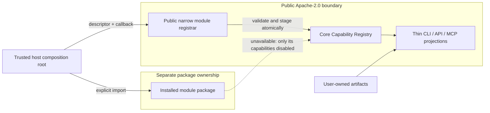

# ADR-006: Commercial Extension Architecture

**Status:** Accepted; public executable module contracts and atomic registrar implemented

## Context

Zeus is an Apache-2.0 open-core platform. The core must remain useful on its own while allowing
explicitly installed packages to contribute capabilities through the existing Capability Registry.
Public extension contracts and safety rules belong in the core. Paid handlers, entitlement
enforcement, and enterprise operations do not.

The current programmatic API has several in-process registries and a broad `registerPlugin` hook.
Those are trusted embedding mechanisms, not a package loader, sandbox, compatibility gate, module
transaction, marketplace, or entitlement boundary. JavaScript executes as soon as an imported
package is evaluated, before any Zeus registration validation can protect the host.

This decision originated in Iteration 26 as a documentation-only specification. Iteration 30
subsequently delivered the public descriptor/status contracts, explicit trusted registrar and
external contract test kit. This update records that delivered state without changing the
historical ownership decision. Commercial behavior and entitlement enforcement remain outside the
public core.

## Decision

### Ownership by edition

Edition is classification metadata. It describes package ownership and expected distribution; it
never grants access and must not be treated as proof of entitlement.

| Edition      | Public core owns                                                                                                                           | Separately distributed implementation owns                                                                                                                      |
| ------------ | ------------------------------------------------------------------------------------------------------------------------------------------ | --------------------------------------------------------------------------------------------------------------------------------------------------------------- |
| Community    | Module, capability, safety, compatibility, status, and artifact contracts; useful CLI/API/local MCP behavior; generic redacted diagnostics | Optional community implementations may be core-bundled or public packages                                                                                       |
| Professional | The same public contracts and neutral registration path                                                                                    | Generation Assurance, bounded repair, advanced validator/policy packs, Db2 Test Intelligence, advanced reporting and model comparison in private packages       |
| Enterprise   | The same public contracts, portability guarantees, and neutral registration path                                                           | Hardened VPC/Kubernetes operation, organization policy/audit/approval, offline entitlement administration, and owner-gated IBM i validation in private packages |

The public core must not contain dormant paid implementations behind flags. It must not branch on
a product ID, module ID, edition, or entitlement state. A commercial module owns its license
storage, validation, and enforcement. Invalid or expired entitlement disables only that module's
capabilities. There is no mandatory telemetry or remote kill switch.

Future package names and repository locations are provisional until availability, trademark, and
legal review. Community packages may be public. Professional and Enterprise implementations must
be in explicitly authorized private packages or repositories; none are created by this decision.

### Module descriptor contract v1

The descriptor is immutable registration input. Its contract version is independent of the Zeus
package version and of each contributed capability contract version. A normalized descriptor v1
has this documented shape:

```json
{
  "descriptorVersion": "zeus.module-descriptor/v1",
  "id": "example.module",
  "version": "1.0.0",
  "edition": "community",
  "compatibility": {
    "moduleApi": ">=1.0.0 <2.0.0"
  },
  "capabilities": [{ "id": "example.inspect", "version": 1 }],
  "safety": {
    "level": "S1",
    "sideEffects": ["local-read"]
  },
  "runtime": {
    "requiredFeatures": ["local-filesystem"]
  },
  "entitlement": {
    "mode": "none"
  },
  "docs": {
    "title": "Example community module",
    "reference": "docs/modules/example.md"
  }
}
```

The required fields and rules are:

- `descriptorVersion`: exactly the supported descriptor contract major.
- `id`: stable, namespaced, non-empty module ID; never inferred from a path.
- `version`: module implementation semantic version.
- `edition`: `community`, `professional`, or `enterprise`; classification only.
- `compatibility.moduleApi`: supported range of the independently versioned public module API.
- `capabilities`: non-empty deterministic list of `{id, version}` references registered through
  the canonical Capability Registry. Each full capability descriptor still declares aliases,
  input/output contracts, availability projections, execution handler, and documentation as
  required by ADR-004.
- `safety`: aggregate safety level and declared side effects. A capability may be stricter, never
  weaker, than the module declaration.
- `runtime.requiredFeatures`: names from a public allowlist, without values, paths, endpoints,
  credentials, or customer identifiers.
- `entitlement.mode`: `none` or `module-managed`. It carries no license material and gives the core
  no enforcement responsibility.
- `docs`: non-secret title and stable reference metadata.

Missing or unknown required classification, compatibility, safety, side-effect, or runtime policy
is rejection. Capability IDs and versions must exactly match the descriptor. Capability side
effects must use the public provider-neutral vocabulary and be a subset of the module's aggregate
declaration. Unknown additive fields are tolerated within v1 and retained only where a normalizer
explicitly permits them. Persisted descriptors have deterministic field order and values and
contain no registration timestamps or raw runtime errors.

Mutable health is not part of the immutable descriptor. A normalized runtime record may pair the
descriptor with:

```json
{
  "lifecycle": "registered",
  "availability": "unavailable",
  "reasonCode": "RUNTIME_FEATURE_MISSING"
}
```

`availability` is `available`, `degraded`, or `unavailable`. Public status exposes only a value
from the closed `REASON_CODES` vocabulary. Unknown module-supplied values fail registration and
are reduced to the neutral `MODULE_UNAVAILABLE` code without echoing the supplied value. The
vocabulary includes:

- `DESCRIPTOR_INVALID`
- `MODULE_API_INCOMPATIBLE`
- `DUPLICATE_MODULE_ID`
- `CAPABILITY_CONFLICT`
- `RUNTIME_FEATURE_MISSING`
- `ENTITLEMENT_UNAVAILABLE`
- `MODULE_POLICY_DENIED`
- `MODULE_INITIALIZATION_FAILED`
- `MODULE_DISABLED`
- `MODULE_UNAVAILABLE` for any unclassified failure

Modules may report only availability outcomes: `AVAILABLE`, runtime or policy unavailability,
entitlement outcomes, `MODULE_DISABLED`, or `MODULE_UNAVAILABLE`. Registration provenance stays
with core: modules cannot report descriptor/API failures, duplicate IDs, capability conflicts,
initialization failures, or `NOT_INSTALLED` as their own registered status.

Raw exceptions, secrets, license material, customer or organization IDs, local paths, and private
endpoints never enter descriptors or public module-status diagnostics. Secrets are never
transmissible. Source, usage, and customer identifiers do not leave the trust zone or get sent for
entitlement or availability validation.

### Explicit registration and trust boundary

The host composition root explicitly imports an installed, operator-trusted package and
passes its descriptor and registration callback to a narrow public registrar. The conceptual API
is the implemented `registerModule({ descriptor, register })` surface exposed through
`createZeus().modules`.

The core never scans directories, package manifests, environment-provided paths, or marketplaces,
and never dynamically `require`s, imports, or evaluates an untrusted name. Explicit import does not
sandbox a package: the operator and package manager remain responsible for trusting its code.



Before invoking contributed behavior, the registrar validates descriptor completeness, descriptor
major, module API compatibility, runtime feature names, module ID uniqueness, exact capability ID
and version, alias ownership, safety classification and side-effect coverage. All registrations
from one module are staged in an isolated registry. The Capability Registry validates the complete
ID/alias batch against snapshot maps and publishes it synchronously only after full validation.
Any conflict or incompatibility rejects the entire module without partially mutating the host
registry, module list or module status.

Module contributions use only the canonical Capability Registry. CLI and MCP remain projections
of registered capability metadata and do not gain module-specific or product-specific branches.
Registration happens during trusted startup before registries are sealed. Module descriptor v1
has no hot reload, unload, replacement, or arbitrary discovery lifecycle.

Lifecycle transitions are deterministic:

```text
declared -> validating -> registered -> available | degraded | unavailable
                    \-> rejected
```

`rejected` means no contribution was committed. An initialization or later availability failure
affects only that module's capabilities. The default core imports no external module, starts with
zero modules, and retains all Community behavior.

### Compatibility and deprecation

Compatibility is negotiated against the public module API contract, not the current beta package
version. A host accepts a module only when it supports the descriptor major and its module API
version satisfies the module's declared range. Unsupported descriptor majors, malformed ranges,
and incompatible ranges fail closed before the registration callback runs.

Additive optional fields may remain in the same descriptor major. Removing or renaming a field,
changing its type or meaning, or making an optional field mandatory requires a new descriptor
major and module API major. Capability input/output contracts retain their own versions. Public
deprecations follow ADR-003: document them, preserve an alias or compatible behavior for at least
one minor release where practical, and provide migration notes before a breaking major change.

### Artifact ownership and portability

Source-derived and user-created artifacts remain owned and controlled by the user. They remain
readable, copyable, exportable, and deletable through ordinary local means when a module is absent,
incompatible, disabled, unentitled, or expired. Core startup and core run/artifact readers never
require a commercial module. A module must never encrypt, lock, delete, or withhold an artifact on
entitlement failure.

Module-produced artifacts carry a public versioned contract plus producer module/capability
provenance. If a specialized renderer is missing, its view may be unavailable, but the raw artifact
and core metadata remain accessible. A module-specific format must either have a public reader
contract or provide a non-entitled export or migration path before it can become a supported
persisted format.

## Consequences

- Community remains a complete, useful baseline and the extension contract is Apache-2.0.
- External packages can contribute capability metadata without changes to CLI or MCP adapters.
- Paid behavior and entitlement enforcement remain separable from core orchestration.
- The public registrar now supplies executable validation, transactional batch registration,
  deterministic closed status and an external contract test kit; the existing broad
  `registerPlugin` hook still does not satisfy this specification.
- Module failure is isolated, while malformed or incompatible registration fails closed.

## Alternatives considered

- **Ship paid code in core behind flags.** Rejected because public source would contain the paid
  implementation and erode the open-core boundary.
- **Create a parallel commercial registry.** Rejected because it would fork safety, adapter, and
  compatibility behavior.
- **Discover modules from directories or configuration strings.** Rejected because arbitrary code
  loading expands the trust boundary and creates ambiguous startup behavior.
- **Use `registerPlugin` as the commercial boundary.** Rejected because it receives the broad Zeus
  object and provides neither compatibility validation nor atomic multi-capability registration.
- **Add per-module CLI or MCP branches.** Rejected because adapters must remain neutral projections.
- **Use package version alone for compatibility.** Rejected because descriptor, module API, and
  capability contracts evolve independently.
- **Expose raw availability errors.** Rejected because exceptions can disclose secrets and private
  environment details.
- **Put entitlement checks in core or lock user artifacts.** Rejected because a paid capability
  failure must not disable core or deny users their data.

## Implemented and remaining boundary

Implemented in the public core: descriptor and status contracts, explicit trusted registration,
module-API/runtime compatibility checks, exact capability matching, closed reason codes,
transactional multi-capability registration, failure isolation, deterministic listing and the
external contract test kit.

Not implemented in the public core: package discovery, arbitrary dynamic loading, sandboxing, hot
reload/unload, marketplace behavior, entitlement validation, license parsing, paid capabilities,
online activation, telemetry or artifact locking. A trusted imported package still runs with the
host process's full rights before and during registration; the registrar is a contract boundary,
not a security sandbox.
