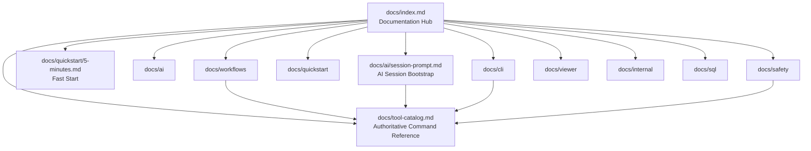

# Zeus RPG PromptKit Documentation Hub (v2.1)

Diese Seite ist der zentrale Einstiegspunkt für Menschen und KI-Assistenten.

## Start Sequence (Safety-First)

1. [`tool-catalog.md`](tool-catalog.md) - verbindliche Command-, Safety- und Scope-Referenz
2. [`ai/session-prompt.md`](ai/session-prompt.md) - Session-Bootstrap für Evidence-First-KI-Workflows
3. [`quickstart/5-minutes.md`](quickstart/5-minutes.md) - schnellster operativer Einstieg
4. [`workflows/investigation-workflows.md`](workflows/investigation-workflows.md) - vertiefende Analysepfade

## Documentation Domains

| Domain | Purpose | Primary Entry | Typical Audience |
|---|---|---|---|
| `ai/` | KI-Verträge, Session-Patterns, Validierung | [`ai/session-prompt.md`](ai/session-prompt.md) | AI Agents, Prompt Engineers |
| `cli/` | Referenz und praxisnahe Kommando-Beispiele | [`cli/reference.md`](cli/reference.md) | Entwickler:innen, Operatoren |
| `quickstart/` | Schneller produktiver Einstieg | [`quickstart/5-minutes.md`](quickstart/5-minutes.md) | Neue Teammitglieder |
| `workflows/` | Geführte Analyse- und Agenten-Workflows | [`workflows/investigation-workflows.md`](workflows/investigation-workflows.md) | Analysten, Architekten |
| `safety/` | Safety-Guidance, Governance, Sharing | [`safety/best-practice-guide.md`](safety/best-practice-guide.md) | Reviewer, Security, Leads |
| `viewer/` | Lokale UI-/Viewer-Architektur | [`viewer/local-ui-shell.md`](viewer/local-ui-shell.md) | Tooling Engineers |
| `sql/` | Reproduzierbare SQL-Discovery-Skripte fuer IBM i/DB2 | [`sql/index.md`](sql/index.md) | Analysts, DB2 Engineers |
| `internal/` | Interne Verträge, Pipelines, technische Details | [`internal/canonical-analysis-model.md`](internal/canonical-analysis-model.md) | Maintainer, Contributors |

## Quick Links For AI Assistants

| Need | Go To | Why |
|---|---|---|
| Authoritative command behavior | [`tool-catalog.md`](tool-catalog.md) | Single source of truth für Commands, Safety und Beispiele |
| Session bootstrap | [`ai/session-prompt.md`](ai/session-prompt.md) | Standardisierte Arbeitsweise mit Safety-Gates |
| Prompt schema and constraints | [`ai/prompt-contracts.md`](ai/prompt-contracts.md) | Verhindert inkonsistente Prompt-Ausgaben |
| Workflow options | [`workflows/investigation-workflows.md`](workflows/investigation-workflows.md) | Zeigt Opt-in Vertiefungsfeatures |
| Safe sharing guidance | [`safety/safe-sharing.md`](safety/safe-sharing.md) | Reduktions-/Sanitization-Regeln für externe Nutzung |
| CLI examples | [`cli/examples.md`](cli/examples.md) | Schnell nutzbare, reproduzierbare Befehlsmuster |
| DB2 discovery SQL | [`sql/system-environment-discovery.sql`](sql/system-environment-discovery.sql) | Standardisierte Discovery-Queries fuer System- und Ticketkontext |

## Visual Map

## Governance Notes

- `docs/tool-catalog.md` bleibt die verbindliche Referenz für KI-Assistenten.
- Dokumentänderungen sollen Safety-Level und Scope-Terminologie konsistent halten (`S0` bis `S4`).
- Geplanter Generator: [`internal/generate-tool-catalog-proposal.md`](internal/generate-tool-catalog-proposal.md).
