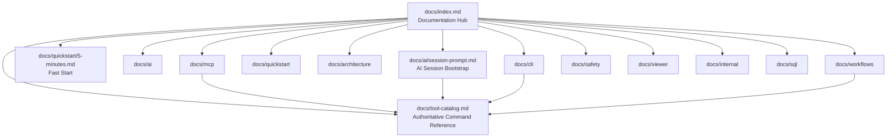

# Zeus RPG PromptKit Documentation Hub (v2.1)

Diese Seite ist der zentrale Einstiegspunkt für Menschen und KI-Assistenten.

## Start Sequence (CLI/MCP-First)

1. Lade die Umgebung explizit in der Shell (`config/load-env.sh` oder `config/load-env.ps1`).
2. Fuehre `doctor` aus, bevor du weitere Aktionen planst.
3. Nutze [`tool-catalog.md`](tool-catalog.md) als verbindliche Command-, Safety- und Scope-Referenz.
4. Starte AI-Sessions mit [`ai/session-prompt.md`](ai/session-prompt.md).
5. Arbeite evidence-first ueber CLI oder MCP und nutze erzeugte Artefakte als Belege.

## Documentation Domains

| Domain | Purpose | Primary Entry | Typical Audience |
|---|---|---|---|
| `ai/` | KI-Verträge, Session-Patterns, Validierung | [`ai/session-prompt.md`](ai/session-prompt.md) | AI Agents, Prompt Engineers |
| `cli/` | Referenz und praxisnahe Kommando-Beispiele | [`cli/reference.md`](cli/reference.md) | Entwickler:innen, Operatoren |
| `quickstart/` | Schneller produktiver Einstieg inkl. **How-To: Credentials verschlüsseln/entschlüsseln** | [`quickstart/5-minutes.md`](quickstart/5-minutes.md), [`quickstart/secrets-and-overrides.md`](quickstart/secrets-and-overrides.md) (Secret Vault), [`quickstart/onboarding-new-ibm-i.md`](quickstart/onboarding-new-ibm-i.md) | Neue Teammitglieder, System-Onboarding |
| `architecture/` | Runtime-, Config- und Systemmodell-Reviews | [`architecture/runtime-config-model-review.md`](architecture/runtime-config-model-review.md) | Maintainer, Tooling Engineers |
| `mcp/` | Lokaler MCP-Betrieb, Policy-Grenzen und Troubleshooting | [`mcp/operator-guide.md`](mcp/operator-guide.md) | Operatoren, AI-Integratoren |
| `workflows/` | Geführte Analyse- und Agenten-Workflows | [`workflows/investigation-workflows.md`](workflows/investigation-workflows.md) | Analysten, Architekten |
| `safety/` | Safety-Guidance, Governance, Sharing | [`safety/best-practice-guide.md`](safety/best-practice-guide.md) | Reviewer, Security, Leads |
| `viewer/` | Optionaler lokaler Artefakt-Viewer und experimentelle UI-Shell | [`viewer/local-ui-shell.md`](viewer/local-ui-shell.md) | Tooling Engineers |
| `sql/` | Reproduzierbare SQL-Discovery-Skripte fuer IBM i/DB2 | [`sql/index.md`](sql/index.md) | Analysts, DB2 Engineers |

## Quick Links For AI Assistants

| Need | Go To | Why |
|---|---|---|
| Authoritative command behavior | [`tool-catalog.md`](tool-catalog.md) | Single source of truth für Commands, Safety und Beispiele |
| Session bootstrap | [`ai/session-prompt.md`](ai/session-prompt.md) | Standardisierte Arbeitsweise mit Safety-Gates |
| MCP operator setup | [`mcp/operator-guide.md`](mcp/operator-guide.md) | Start-/Policy-/Audit-Referenz fuer lokalen MCP-Betrieb |
| Prompt schema and constraints | [`ai/prompt-contracts.md`](ai/prompt-contracts.md) | Verhindert inkonsistente Prompt-Ausgaben |
| Workflow options | [`workflows/investigation-workflows.md`](workflows/investigation-workflows.md) | Zeigt Opt-in Vertiefungsfeatures |
| Runtime config architecture | [`architecture/runtime-config-model-review.md`](architecture/runtime-config-model-review.md) | Erklaert Prioritaeten, Profilstruktur und lokale Tooling-Vertraege |
| Safe sharing guidance | [`safety/safe-sharing.md`](safety/safe-sharing.md) | Reduktions-/Sanitization-Regeln für externe Nutzung |
| CLI examples | [`cli/examples.md`](cli/examples.md) | Schnell nutzbare, reproduzierbare Befehlsmuster |
| DB2 discovery SQL | [`sql/system-environment-discovery.sql`](sql/system-environment-discovery.sql) | Standardisierte Discovery-Queries fuer System- und Ticketkontext |

## Visual Map

## Governance Notes

- `docs/tool-catalog.md` bleibt die verbindliche Referenz für KI-Assistenten.
- CLI und MCP bleiben der unterstützte Produktpfad; der lokale Viewer ist optional und experimentell.
- Dokumentänderungen sollen Safety-Level und Scope-Terminologie konsistent halten (`S0` bis `S4`).
- Regenerierung funktioniert direkt ueber `zeus docs:generate-catalog` oder `zeus docs generate-catalog` und haelt den Tool-Katalog aktuell.
- Optional maschinenlesbar: `zeus docs:generate-catalog --json-output docs/tool-catalog.json`.
- Tool catalog is auto-generated from code (see `zeus docs:generate-catalog`).
