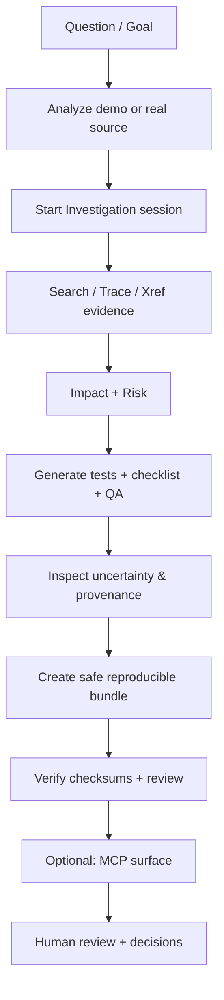

# Zeus in 5 Minutes — The Evidence Investigation Golden Path

**Core promise:** Turn a question about an IBM i application ("What is affected if we change this field?") into **reproducible, review-ready evidence artifacts** while keeping humans in full control.

> Zeus RPG PromptKit — Evidence and Investigation Platform for IBM i  
> Collects, normalizes and analyzes RPG/CL/DDS + Db2 evidence. Produces reviewable artifacts. Never claims autonomous correctness or production writes.

This page is the **concise canonical journey**. All commands use the public demo mini-system (`examples/demo-rpg-mini-system/rpg_sources`, PROGRAM_100 etc.). No real IBM i or credentials required for the local path.

## The 11-Step Golden Path (Question → Review Bundle)

1. **Install & verify runtime**

   ```bash
   npm install
   node cli/zeus.js doctor --help
   ```

2. **Run doctor (local profile)**

   ```bash
   # For pure local demo (no DB/fetch):
   node cli/zeus.js doctor --profile default --show-resolved || true
   ```

3. **Analyze the demo source (reproducible, documentation mode)**

   ```bash
   node cli/zeus.js analyze \
     --source ./examples/demo-rpg-mini-system/rpg_sources \
     --program PROGRAM_100 \
     --out ./examples/demo-rpg-mini-system/output-golden \
     --mode documentation \
     --optimize-context \
     --reproducible
   ```

4. **Start investigation with a clear goal**

   ```bash
   node cli/zeus.js investigate \
     --program PROGRAM_100 \
     --out ./examples/demo-rpg-mini-system/output-golden \
     --goal "What is affected if we change the ID/STATUS fields?"
   ```

5. **Deepen evidence (search / trace / xref)**

   ```bash
   node cli/zeus.js search-source --source-root ./examples/demo-rpg-mini-system/rpg_sources --search-term ID,STATUS || true
   node cli/zeus.js trace --field ID --start-program PROGRAM_200 --source ./examples/demo-rpg-mini-system/rpg_sources || true
   node cli/zeus.js xref --program PROGRAM_200 --source ./examples/demo-rpg-mini-system/rpg_sources || true
   ```

6. **Impact & risk**

   ```bash
   node cli/zeus.js impact --target ID --program PROGRAM_100 --out ./examples/demo-rpg-mini-system/output-golden --source ./examples/demo-rpg-mini-system/rpg_sources || true
   node cli/zeus.js assess-risk --program PROGRAM_100 --out ./examples/demo-rpg-mini-system/output-golden || true
   ```

7. **Generate tests & checklist**

   ```bash
   node cli/zeus.js generate-test --program PROGRAM_100 --format markdown --out ./examples/demo-rpg-mini-system/output-golden || true
   node cli/zeus.js generate-checklist --program PROGRAM_100 --out ./examples/demo-rpg-mini-system/output-golden || true
   node cli/zeus.js qa --input ./examples/demo-rpg-mini-system/output-golden/PROGRAM_100 --format markdown || true
   ```

8. **Inspect uncertainty & provenance**
   Look at `canonical-analysis.json`, manifests, and any "unresolved" or "dynamic" notes in the reports.

9. **Create safe, reproducible review bundle**

   ```bash
   node cli/zeus.js bundle \
     --program PROGRAM_100 \
     --output ./examples/demo-rpg-mini-system/output-golden/bundle \
     --include-json --include-md --safe-sharing || true
   ```

10. **(Optional) Same journey via MCP**

    ```bash
    node cli/zeus.js mcp --help
    # Then use MCP client against zeus mcp serve (local only)
    ```

11. **Verify bundle contents and checksums**
    ```bash
    ls -l ./examples/demo-rpg-mini-system/output-golden/bundle/
    # Check manifests contain stable keys, no absolute paths, redacted identifiers when --safe-sharing used.
    ```

Run the full demo script for automation:

```bash
npm run demo:run
```

## What Zeus Is / Is Not

**Is**

- Evidence preparation layer (source + metadata → structured artifacts)
- Reproducible investigation sessions with provenance
- Local-first, human-approved, auditable
- Safe-sharing for external review
- MCP + CLI surface for agents and humans

**Is not**

- Autonomous code generator or modernizer
- Guarantee of correctness or completeness
- Production writer / mutator of IBM i
- Cloud-hosted service (local only)
- Replacement for human review and testing

## Privacy & Safe Sharing

Always use `--safe-sharing` before sharing artifacts outside your team.
See [`docs/safety/safe-sharing.md`](safety/safe-sharing.md).

## Lifecycle Diagram (Investigation Golden Path)



## Next Steps & Limitations

- Full new-system onboarding: see `docs/quickstart/onboarding-new-ibm-i.md`
- All artifacts are local. No network calls unless you explicitly provide credentials.
- Some features (full catalog, certain Db2 queries) are best-effort when no live system is configured.
- Always review generated prompts and artifacts before sending to any AI model.

This journey (question → evidence → bundle) is the **product golden path**. Everything else in Zeus supports it.
