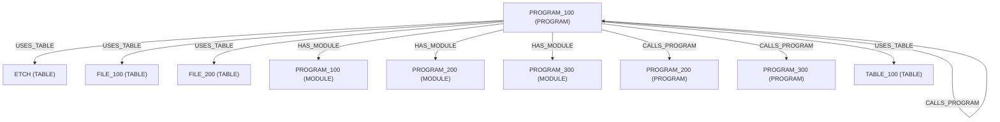

# Architecture Report

Program: PROGRAM_100

Generated: 2000-01-01T00:00:00.000Z

## Architecture Complexity

- Tables: 4
- Programs Called: 3
- Copy Members: 0
- SQL Statements: 2
- Modules: 3
- Service Programs: 0
- Binding Directories: 0

## Overview

Program PROGRAM_100 interacts with 4 database tables and calls 3 external programs. The program contains embedded SQL statements (1 read, 1 write, 0 dynamic) and includes 0 copy members. Native file usage covers 3 files, including 1 mutating and 0 interactive files. Bind-time modeling covers 3 modules, 0 service programs, and 0 binding directories.

## Program Dependencies

### Called Programs

- PROGRAM_100
- PROGRAM_200
- PROGRAM_300

## Database Dependencies

### Tables Used

- ETCH
- FILE_100
- FILE_200
- TABLE_100

## Native File I/O

- Native Files: 3
- Mutating Files: 1
- Interactive Files: 0
- Workstation Files: 0
- Printer Files: 0
- Keyed Files: 1
- Record Formats: 0

- ETCH [FILE]
- FILE_100 [DISK, READ, KEYED]
- FILE_200 [DISK, READ, UPDATE, MUTATING]

## Binding Analysis

- Modules: 3
- NoMain Modules: 0
- Service Programs: 0
- Binder Sources: 0
- Binding Directories: 0
- Bound Modules: 0
- Unresolved Bindings: 0
- Exported Symbols: 0

### Modules
- PROGRAM_100 [PROGRAM_MODULE]
- PROGRAM_200 [PROGRAM_MODULE]
- PROGRAM_300 [PROGRAM_MODULE]

### Service Programs
- None detected

## Copy Member Dependencies

### Copy Members

- None detected

## SQL Activity

- Read statements: 1
- Write statements: 1
- Dynamic statements: 0
- Unresolved statements: 0
- Cursor statements: 1
- Host variables: 1
- Cursors: 1

- SELECT statements: 1
- UPDATE statements: 1

Examples

## Dependency Graph

## Data Flow Overview

PROGRAM_100 reads data from ETCH, FILE_100, FILE_200, updates ETCH, FILE_100, FILE_200, invokes external programs PROGRAM_100, PROGRAM_200, updates native files.
