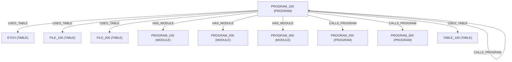

# Dependency Graph

The following diagram shows dependencies for program PROGRAM_100.

Tables: 4
Programs Called: 3
Copy Members: 0
Modules: 3
Service Programs: 0
Binding Directories: 0
Bind Relationships: 3

